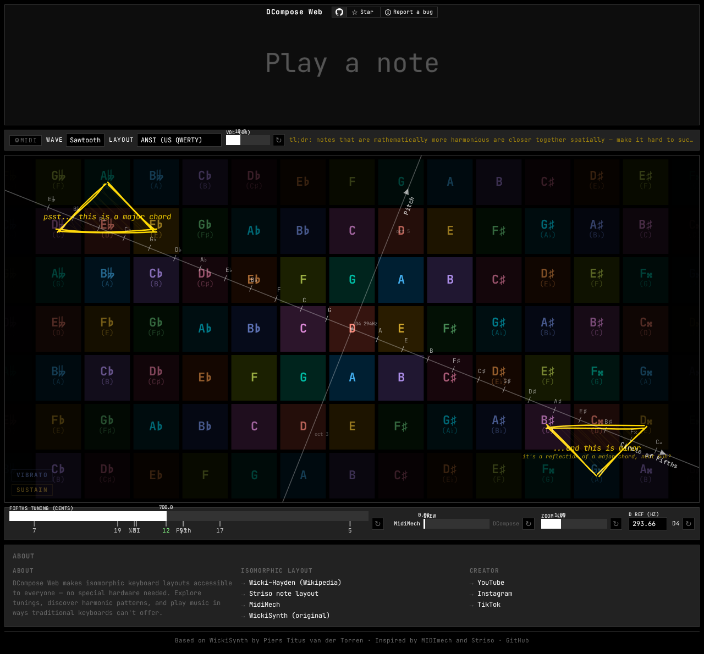

# GridInstruments

A browser synthesizer built on the [Wicki-Hayden](https://en.wikipedia.org/wiki/Wicki-Hayden_note_layout) isomorphic keyboard layout — discovered through [WickiSynth](https://www.toverlamp.org/static/wickisynth/wickisynth_lowlatency.html) by Piers Titus van der Torren, the [MIDImech](https://github.com/flipcoder/midimech) visualizer by flipcoder, and the physical [Striso board](https://www.striso.org/the-note-layout/) by Piers Titus van der Torren. Runs in the browser with Web Audio, Web MIDI, MPE output, microtonality, and note history.

**[Try it live](https://gridinstruments.xyz)** · [⭐ Star on GitHub](https://github.com/zitongcharliedeng/gridinstruments) · [PolyForm NC License](LICENSE) — open source, always free. Donations welcome but never required.



## Features

- **Isomorphic grid** — DCompose / Wicki-Hayden layout, continuous DCompose↔MidiMech skew
- **Web Audio** — direct oscillator synthesis, multiple waveforms, zero-latency
- **Web MIDI** — live MIDI input with per-device enable/disable
- **MPE output** *(in progress)* — send expressive MIDI to external synths
- **Microtonality** — continuous fifth slider (7-TET through 5-TET), reference markers
- **Note history** — waterfall + staff notation, chord detection
- **Chromesthesia** — pitch-class colors in OKLCH

## Controls

| Control | Action |
|---------|--------|
| Letter/number keys | Play notes |
| `Shift` hold | Vibrato |
| `Space` hold | Sustain |
| Skew slider | DCompose (1.0) ↔ MidiMech (0.0) |
| Fifth slider | Tune generator (double-click = nearest TET) |
| Layout dropdown | Keyboard physical layout variant |

## Credits

- **[Wicki-Hayden layout](https://en.wikipedia.org/wiki/Wicki-Hayden_note_layout)** by Kaspar Wicki and Brian Hayden — the isomorphic keyboard layout this is built on
- **[WickiSynth](https://www.toverlamp.org/static/wickisynth/wickisynth_lowlatency.html)** by Piers Titus van der Torren — original browser synthesizer for this layout; the gateway to finding it
- **[MIDImech](https://github.com/flipcoder/midimech)** by flipcoder — isomorphic layout visualizer and engine
- **[Striso board](https://www.striso.org/the-note-layout/)** by Piers Titus van der Torren — physical isomorphic instrument with the same layout
- **[isomorphic-qwerty](https://github.com/xenharmonic-devs/isomorphic-qwerty)** by Xenharmonic Devs — keyboard coordinate library

## Development

```bash
npm install
npm run dev      # Vite dev server on :5173
npm run build    # tsc + vite build
npx playwright test --project=chromium  # run tests
```
