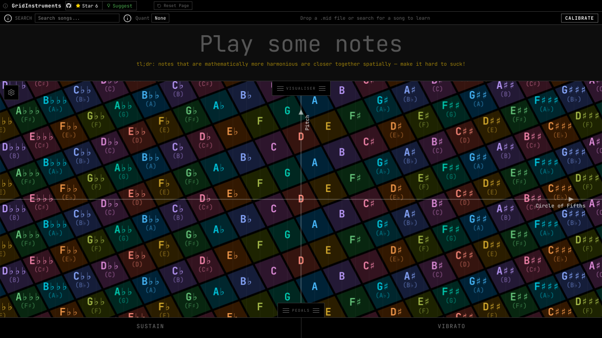
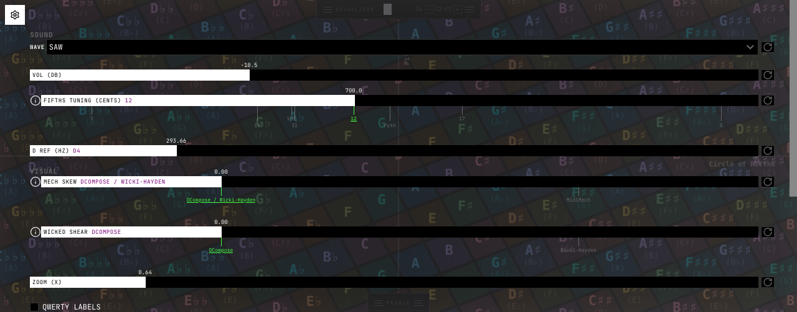

# Invariant Checks

Structural invariants for XState graph-based test generation — DOM checks, golden screenshots, slider fill assertions, MPE protocol checks, game engine tests, and more.

``` {.typescript file=_generated/tests/machines/invariant-checks.ts}

import type { Page } from '@playwright/test';
import { expect } from '@playwright/test';
import type { StateInvariant } from './types';
import { overlayMachine } from '../../machines/overlayMachine';
import { pedalMachine } from '../../machines/pedalMachines';
import { panelMachine } from '../../machines/panelMachine';
import { gameMachine, type NoteGroup } from '../../machines/gameMachine';
import { createActor } from 'xstate';
import {
  overlayMachine as testOverlayMachine,
  visualiserMachine as testVisualiserMachine,
  pedalsMachine as testPedalsMachine,
  waveformMachine as testWaveformMachine,
  sustainMachine as testSustainMachine,
  vibratoMachine as testVibratoMachine,
} from './uiMachine';


```

## UI Element Invariants

Structural checks for tooltips, panel handles, overlays, and icon sizes.

``` {.typescript file=_generated/tests/machines/invariant-checks.ts}
export const tooltipCheck: StateInvariant = {
  id: 'BH-TT-1',
  description: 'No raw title= tooltips — all controls use info button + dialog',
  check: async (page: Page) => {
    const result = await page.evaluate(() => {
      const all = Array.from(document.querySelectorAll('[title]'));
      const owned = all.filter(el => {
        if (el.closest('.ss-main, .ss-content')) return false;
        if (el.tagName === 'SELECT') return false;
        if (el.classList.contains('slider-preset-btn')) return false;
        return true;
      });
      return { count: owned.length, list: owned.map(el => `${el.tagName}#${el.id}: ${el.getAttribute('title')}`).join(', ') };
    });
    if (result.count > 0) {
      throw new Error(`${result.count} elements have title= tooltips (excluding slim-select/presets): ${result.list}`);
    }
  },
};

export const visHandlePosition: StateInvariant = {
  id: 'PNL-VIS-4',
  check: async (page: Page) => {
    const panelBox = await page.locator('#visualiser-panel').boundingBox();
    const handleBox = await page.locator('#visualiser-panel .panel-resize-handle').boundingBox();
    if (!panelBox) throw new Error('#visualiser-panel not visible');
    if (!handleBox) throw new Error('.panel-resize-handle not visible');
    const panelBottom = panelBox.y + panelBox.height;
    const handleTop = handleBox.y;
    expect(Math.abs(handleTop - panelBottom)).toBeLessThan(4);
  },
};

export const pianoRollVisible: StateInvariant = {
  id: 'BH-PIANOROLL-1',
  check: async (page: Page) => {
    const canvas = page.locator('#history-canvas');
    await expect(canvas).toBeVisible();
    const box = await canvas.boundingBox();
    if (!box) throw new Error('#history-canvas not visible');
    expect(box.width).toBeGreaterThan(100);
    expect(box.height).toBeGreaterThan(50);
  },
};


```

Continuing with `pedHandlePosition` and related invariants.

``` {.typescript file=_generated/tests/machines/invariant-checks.ts}
export const pedHandlePosition: StateInvariant = {
  id: 'PNL-VIS-5',
  check: async (page: Page) => {
    const panelBox = await page.locator('#pedals-panel').boundingBox();
    const handleBox = await page.locator('#pedals-panel .panel-resize-handle').boundingBox();
    if (!panelBox) throw new Error('#pedals-panel not visible');
    if (!handleBox) throw new Error('.panel-resize-handle not visible');
    const panelTop = panelBox.y;
    const handleBottom = handleBox.y + handleBox.height;
    expect(Math.abs(handleBottom - panelTop)).toBeLessThan(4);
  },
};

export const overlayBgCheck: StateInvariant = {
  id: 'OV-BG-1',
  check: async (page: Page) => {
    const bg = await page.locator('#grid-overlay').evaluate(
      el => getComputedStyle(el).backgroundColor
    );
    const match = /rgba?\((\d+),\s*(\d+),\s*(\d+),?\s*([\d.]+)?\)/.exec(bg);
    if (!match) throw new Error('Background should be rgba');
    expect(parseInt(match[1])).toBeCloseTo(30, 0);
    expect(parseInt(match[2])).toBeCloseTo(30, 0);
    expect(parseInt(match[3])).toBeCloseTo(32, 0);
    if (match[4]) {
      expect(parseFloat(match[4])).toBeCloseTo(0.78, 1);
    }
  },
};

export const overlayShimmerCheck: StateInvariant = {
  id: 'OV-SHIMMER-1',
  check: async (page: Page) => {
    const animDuration = await page.evaluate(() => {
      const el = document.querySelector('#grid-overlay');
      if (!el) throw new Error('#grid-overlay not found');
      return getComputedStyle(el, '::before').animationDuration;
    });
    expect(animDuration).toContain('60s');
  },
};


```

Continuing with `overlaySectionsCheck` and related invariants.

``` {.typescript file=_generated/tests/machines/invariant-checks.ts}
export const overlaySectionsCheck: StateInvariant = {
  id: 'OV-SECTIONS-1',
  check: async (page: Page) => {
    const sectionCount = await page.locator('#grid-overlay .overlay-section').count();
    expect(sectionCount).toBeGreaterThanOrEqual(4);
  },
};

export const overlayPresetCheck: StateInvariant = {
  id: 'OV-PRESET-1',
  check: async (page: Page) => {
    const activePreset = await page.locator('#tet-presets .slider-preset-btn.active').count();
    expect(activePreset).toBeGreaterThanOrEqual(1);
    const activeValue = await page.locator('#tet-presets .slider-preset-btn.active').first().getAttribute('data-value');
    expect(parseFloat(activeValue ?? '0')).toBe(700);
  },
};

export const mpeUiCheck: StateInvariant = {
  id: 'BH-MPE-1',
  check: async (page: Page) => {
    await expect(page.locator('#mpe-enabled')).toBeVisible();
    const outputUiCount = await page.locator('#mpe-output-select, #mpe-output-select-slot .ss-main').count();
    expect(outputUiCount).toBeGreaterThan(0);
  },
};

export const focusPreserveCheck: StateInvariant = {
  id: 'BH-FOCUS-PRESERVE-1',
  check: async (page: Page) => {
    const activeTagName = await page.evaluate(() => document.activeElement?.tagName);
    expect(activeTagName).not.toBe('INPUT');
    expect(activeTagName).not.toBe('SELECT');
  },
};

export const iconSizeCheck: StateInvariant = {
  id: 'BH-ICON-1',
  check: async (page: Page) => {
    const checks: { selector: string; expectedPx: number; label: string }[] = [
      { selector: '#about-btn svg', expectedPx: 11, label: 'about-btn icon' },
      { selector: '.star-icon svg', expectedPx: 10, label: 'star icon' },
      { selector: '#reset-layout .icon svg', expectedPx: 9, label: 'reset-layout icon' },
      { selector: '.slider-info-btn svg', expectedPx: 18, label: 'slider-info icon (icon-lg)' },
      { selector: '.slider-reset svg', expectedPx: 16, label: 'slider-reset icon (icon-md)' },
      { selector: '#grid-settings-btn svg', expectedPx: 16, label: 'grid-cog icon (icon-md)' },
    ];
    for (const { selector, expectedPx, label } of checks) {
      const el = page.locator(`${selector}:visible`).first();
      await expect(el).toBeVisible();
      const box = await el.boundingBox();
      if (!box) throw new Error(`${label} must be visible`);
      expect(Math.round(box.width), `${label} width`).toBeCloseTo(expectedPx, -1);
      expect(Math.round(box.height), `${label} height`).toBeCloseTo(expectedPx, -1);
    }
  },
};


```

Continuing with `visCap60Check` and related invariants.

``` {.typescript file=_generated/tests/machines/invariant-checks.ts}
export const visCap60Check: StateInvariant = {
  id: 'PNL-DRAG-4',
  check: async (page: Page) => {
    const panelBox = await page.locator('#visualiser-panel').boundingBox();
    if (!panelBox) throw new Error('#visualiser-panel not visible');
    const panelH = panelBox.height;
    const vp = page.viewportSize();
    if (!vp) throw new Error('viewport size unavailable');
    const viewportH = vp.height;
    expect(panelH).toBeLessThanOrEqual(viewportH * 0.61);
  },
};


```

## Slider Invariants

Slider fill colors, badge positioning, pointer events, and value range assertions.

``` {.typescript file=_generated/tests/machines/invariant-checks.ts}
export function createSliderFillDefaultInvariant(sliderId: string): StateInvariant {
  return {
    id: `FILL-DEFAULT-${sliderId}`,
    check: async (page: Page) => {
      const bg = await page.locator('#' + sliderId).evaluate(
        (el) => {
          if (!(el instanceof HTMLElement)) throw new Error('not HTMLElement');
          return el.style.background;
        }
      );
      expect(bg).toContain('linear-gradient');
    },
  };
}

export function createSliderFillModifiedInvariant(sliderId: string): StateInvariant {
  return {
    id: `FILL-MODIFIED-${sliderId}`,
    check: async (page: Page) => {
      const bg = await page.locator('#' + sliderId).evaluate(
        (el) => {
          if (!(el instanceof HTMLElement)) throw new Error('not HTMLElement');
          return el.style.background;
        }
      );
      expect(bg).toContain('linear-gradient');
    },
  };
}


export const sliderBadgePositionCheck: StateInvariant = {
  id: 'SM-BADGE-ALL',
  check: async (page: Page) => {
    const pairs = [
      { slider: '#tuning-slider', badge: '#tuning-thumb-badge', label: 'tuning' },
      { slider: '#skew-slider', badge: '#skew-thumb-badge', label: 'skew' },
      { slider: '#zoom-slider', badge: '#zoom-thumb-badge', label: 'zoom' },
      { slider: '#volume-slider', badge: '#volume-thumb-badge', label: 'volume' },
    ];
    for (const { slider, badge, label } of pairs) {
      const track = await page.locator(slider).locator('..').boundingBox();
      if (!track) throw new Error(`${slider} parent not visible`);
      const badgeBox = await page.locator(badge).boundingBox();
      if (!badgeBox) throw new Error(`${badge} not visible`);
      expect(badgeBox.y + badgeBox.height, `${label} badge bottom ≤ track top`).toBeLessThanOrEqual(track.y + 2);
    }
  },
};


```

Continuing with `badgePointerEventsCheck` and related invariants.

``` {.typescript file=_generated/tests/machines/invariant-checks.ts}
export const badgePointerEventsCheck: StateInvariant = {
  id: 'SM-BADGE-PE',
  check: async (page: Page) => {
    const nonEditable = ['#zoom-thumb-badge', '#volume-thumb-badge'];
    for (const sel of nonEditable) {
      const pe = await page.locator(sel).evaluate(el => getComputedStyle(el).pointerEvents);
      expect(pe, `${sel} pointer-events`).toBe('none');
    }
    const editable = ['#tuning-thumb-badge', '#skew-thumb-badge'];
    for (const sel of editable) {
      const pe = await page.locator(sel).evaluate(el => getComputedStyle(el).pointerEvents);
      expect(pe, `${sel} pointer-events`).toBe('auto');
    }
  },
};

export const sliderLabelPositionCheck: StateInvariant = {
  id: 'SM-LABEL-POS',
  check: async (page: Page) => {
    const pairs = [
      { slider: '#tuning-slider', label: '#tuning-label', name: 'tuning' },
      { slider: '#skew-slider', label: '#skew-label', name: 'skew' },
    ];
    for (const { slider, label, name } of pairs) {
      const track = await page.locator(slider).locator('..').boundingBox();
      if (!track) throw new Error(`${slider} parent not visible`);
      const labelBox = await page.locator(label).boundingBox();
      if (!labelBox) throw new Error(`${label} not visible`);
      expect(labelBox.y, `${name} label top`).toBeGreaterThanOrEqual(track.y - 1);
      expect(labelBox.y + labelBox.height, `${name} label bottom`).toBeLessThanOrEqual(track.y + track.height + 1);
    }
  },
};

export const sliderValuesCheck: StateInvariant = {
  id: 'SM-VAL-ALL',
  check: async (page: Page) => {
    const tuningVal = await page.locator('#tuning-thumb-badge').inputValue();
    expect(tuningVal).not.toContain('¢');
    expect(parseFloat(tuningVal)).toBeCloseTo(700, 0);

    const volText = await page.locator('#volume-thumb-badge').textContent();
    if (volText === null) throw new Error('#volume-thumb-badge text is null');
    expect(parseFloat(volText)).toBeCloseTo(-10.5, 0);

    const zoomText = await page.locator('#zoom-thumb-badge').textContent();
    if (zoomText === null) throw new Error('#zoom-thumb-badge text is null');
    expect(zoomText).not.toContain('x');
    const expectedZoom = await page.evaluate((): number => {
      const g = window as unknown as { dcomposeApp?: { getDefaultZoom: () => number } };
      return g.dcomposeApp?.getDefaultZoom() ?? 0.75;
    });
    expect(parseFloat(zoomText)).toBeCloseTo(expectedZoom, 1);

    const skewVal = await page.locator('#skew-thumb-badge').inputValue();
    expect(skewVal).toBe('0.00');

    const tuningText = await page.locator('#tuning-label').textContent();
    if (tuningText === null) throw new Error('#tuning-label text is null');
    expect(tuningText.toUpperCase()).toContain('FIFTHS TUNING');
    expect(tuningText.toUpperCase()).toContain('CENTS');

    const drefVal = await page.locator('#d-ref-input').inputValue();
    expect(drefVal).toBe('293.66');
    const drefLabelText = await page.locator('#d-ref-label').textContent();
    if (drefLabelText === null) throw new Error('#d-ref-label text is null');
    expect(drefLabelText).toContain('D REF');

    const drefGroupText = await page.locator('.d-ref-group .slider-label-overlay').textContent();
    if (drefGroupText === null) throw new Error('.d-ref-group .slider-label-overlay text is null');
    expect(drefGroupText.toUpperCase()).toContain('D REF');
    expect(drefGroupText.toUpperCase()).toContain('HZ');
  },
};


```

Continuing with `tetBelowTrackCheck` and related invariants.

``` {.typescript file=_generated/tests/machines/invariant-checks.ts}
export const tetBelowTrackCheck: StateInvariant = {
  id: 'SM-TET-BELOW',
  check: async (page: Page) => {
    const track = await page.locator('#tuning-slider').locator('..').boundingBox();
    if (!track) throw new Error('#tuning-slider parent not visible');
    const marks = page.locator('.slider-preset-mark');
    const count = await marks.count();
    expect(count).toBeGreaterThan(0);
    const trackCenter = track.y + track.height / 2;
    for (let i = 0; i < count; i++) {
      const tick = await marks.nth(i).locator('.slider-tick').boundingBox();
      if (!tick) throw new Error(`.slider-tick[${i}] not visible`);
      expect(Math.abs(tick.y - trackCenter)).toBeLessThanOrEqual(250);
      const btn = await marks.nth(i).locator('.slider-preset-btn').boundingBox();
      if (!btn) throw new Error(`.slider-preset-btn[${i}] not visible`);
      expect(btn.y).toBeGreaterThanOrEqual(track.y + track.height - 2);
    }
  },
};

```

## Overlay Color and Annotation Checks

Overlay section colors, D-ref annotations, and overlay control visibility.

``` {.typescript file=_generated/tests/machines/invariant-checks.ts}
export const overlayColorsCheck: StateInvariant = {
  id: 'SM-COLOR-OVERLAY',
  check: async (page: Page) => {
    const colors = await page.locator('.overlay-section .ctrl-label').evaluateAll(
      els => els.map(el => getComputedStyle(el).color)
    );
    for (const c of colors) {
      expect(c).toBe('rgb(255, 255, 255)');
    }

    const tuningColor = await page.locator('#tuning-label').evaluate(
      el => getComputedStyle(el).color
    );
    expect(tuningColor).toBe('rgb(255, 255, 255)');

    const drefColor = await page.locator('.d-ref-group .slider-label-overlay').evaluate(
      el => getComputedStyle(el).color
    );
    expect(drefColor).toBe('rgb(255, 255, 255)');
  },
};

export const drefAnnotationCheck: StateInvariant = {
  id: 'SM-COLOR-2',
  check: async (page: Page) => {
    const val = await page.locator('#d-ref-input').inputValue();
    expect(val).not.toContain('(');
    expect(val).not.toContain('[');
    const labelText = await page.locator('#d-ref-label').textContent();
    if (labelText === null) throw new Error('#d-ref-label text is null');
    expect(labelText).toContain('D REF');
  },
};

export const overlayControlsCheck: StateInvariant = {
  id: 'SM-STRUCT-OVERLAY',
  check: async (page: Page) => {
    const resetIds = ['tuning-reset', 'skew-reset', 'zoom-reset', 'volume-reset', 'd-ref-reset'];
    for (const id of resetIds) {
      const btn = page.locator(`#${id}`);
      await expect(btn).toBeVisible();
      const svg = btn.locator('svg');
      await expect(svg).toBeVisible();
    }

    const selectors = ['#grid-overlay', 'select', 'input[type="text"]'];
    for (const sel of selectors) {
      const els = page.locator(sel);
      const count = await els.count();
      for (let i = 0; i < count; i++) {
        const br = await els.nth(i).evaluate(el => getComputedStyle(el).borderRadius);
        expect(br, `${sel}[${i}] borderRadius`).toBe('0px');
      }
    }

    const drefWidth = await page.locator('#d-ref-input').evaluate(
      el => getComputedStyle(el).width
    );
    expect(parseFloat(drefWidth)).toBeCloseTo(80, -1);

    const paddingTop = await page.locator('.tuning-slider-area').first().evaluate(
      el => getComputedStyle(el).paddingTop
    );
    expect(paddingTop).toBe('0px');
  },
};


```

Continuing with `appLoadedCheck` and related invariants.

``` {.typescript file=_generated/tests/machines/invariant-checks.ts}
export const appLoadedCheck: StateInvariant = {
  id: 'SM-APP-LOADED',
  check: async (page: Page) => {
    const titleColor = await page.locator('.site-title').evaluate(
      el => getComputedStyle(el).color
    );
    expect(titleColor).toBe('rgb(255, 255, 255)');

    const ghSvgFill = await page.locator('.gh-mark svg').evaluate(
      el => getComputedStyle(el).fill
    );
    expect(ghSvgFill).toBe('rgb(255, 255, 255)');

    const btnColors = await page.locator('.gh-btn').evaluateAll(
      els => els.map(el => getComputedStyle(el).color)
    );
    const allowedColors = ['rgb(255, 255, 255)', 'rgb(76, 175, 80)'];
    for (const c of btnColors) {
      expect(allowedColors).toContain(c);
    }

    const bodyBg = await page.locator('body').evaluate(
      el => getComputedStyle(el).backgroundColor
    );
    expect(bodyBg).toBe('rgb(0, 0, 0)');

    const fontFamily = await page.locator('body').evaluate(
      el => getComputedStyle(el).fontFamily
    );
    expect(fontFamily).toContain('JetBrains Mono');

    const result = await page.evaluate(() => {
      const el = document.getElementById('keyboard-canvas');
      if (!(el instanceof HTMLCanvasElement)) return { canvasWidth: 0, cssWidth: 0, dpr: 1, ratio: 0 };
      const dpr = window.devicePixelRatio > 0 ? window.devicePixelRatio : 1;
      const cssWidth = el.getBoundingClientRect().width;
      return {
        canvasWidth: el.width,
        cssWidth,
        dpr,
        ratio: cssWidth > 0 ? el.width / cssWidth : 0,
      };
    });
    expect(result.cssWidth).toBeGreaterThan(0);
    expect(Math.abs(result.ratio - result.dpr)).toBeLessThan(0.1);

    const kbBr = await page.locator('#keyboard-container').evaluate(
      el => getComputedStyle(el).borderRadius
    );
    expect(kbBr).toBe('0px');
  },
};


```

## Golden Screenshot Comparisons

Pixel-accurate golden image comparisons for full page, overlay, mobile, and QWERTY states. Each test compares a live screenshot against the reference image below.

**Full page reference:**


**Overlay open reference:**


**QWERTY overlay reference:**


``` {.typescript file=_generated/tests/machines/invariant-checks.ts}
export const overlayGoldenCheck: StateInvariant = {
  id: 'GOLDEN-OVERLAY',
  check: async (page: Page) => {
    await expect(page.locator('#grid-overlay')).toHaveScreenshot('grid-overlay.png');
  },
};

export const fullPageGoldenCheck: StateInvariant = {
  id: 'GOLDEN-FULL-PAGE',
  check: async (page: Page) => {
    await expect(page).toHaveScreenshot('full-page.png', { fullPage: true });
  },
};

export const overlayGoldenCheck2: StateInvariant = {
  id: 'GOLDEN-OVERLAY-2',
  check: async (page: Page) => {
    await page.locator('#grid-settings-btn').click();
    await page.waitForTimeout(400);
    await expect(page.locator('#grid-overlay')).toHaveScreenshot('overlay-open.png');
    await page.keyboard.press('Escape');
  },
};

export const mobileGoldenCheck: StateInvariant = {
  id: 'GOLDEN-MOBILE',
  check: async (page: Page) => {
    await page.setViewportSize({ width: 375, height: 812 });
    await page.waitForTimeout(300);
    await expect(page).toHaveScreenshot('mobile-375.png', { fullPage: true });
    await page.setViewportSize({ width: 1280, height: 900 });
  },
};

export const qwertyGoldenCheck: StateInvariant = {
  id: 'GOLDEN-QWERTY',
  description: 'QWERTY labels visible by default — golden screenshot',
  check: async (page: Page) => {
    await page.waitForTimeout(500);
    await expect(page.locator('#keyboard-canvas')).toHaveScreenshot('qwerty-labels.png');
  },
};


```

Continuing with `keyboardCanvasGoldenCheck` and related invariants.

``` {.typescript file=_generated/tests/machines/invariant-checks.ts}
export const keyboardCanvasGoldenCheck: StateInvariant = {
  id: 'GOLDEN-KEYBOARD',
  check: async (page: Page) => {
    await expect(page.locator('#keyboard-canvas')).toHaveScreenshot('keyboard-canvas.png');
  },
};

export const tetNotchGoldenCheck: StateInvariant = {
  id: 'GOLDEN-TET-NOTCH',
  check: async (page: Page) => {
    const tetPresets = page.locator('#tet-presets');
    await expect(tetPresets).toBeVisible();
    await expect(tetPresets).toHaveScreenshot('tuning-notch-labels.png');
  },
};


```

## DOM Structure Invariants

Handle parenting, ARIA labels, scrollbar dimensions, slim-select theming, and native select absence.

``` {.typescript file=_generated/tests/machines/invariant-checks.ts}
export const handleDomParent: StateInvariant = {
  id: 'PNL-VIS-6',
  check: async (page: Page) => {
    const inVisualiser = await page.locator('#visualiser-panel .panel-resize-handle').count();
    const inGrid = await page.locator('#grid-area .panel-resize-handle').count();
    expect(inVisualiser).toBe(1);
    expect(inGrid).toBe(0);
  },
};

export const panelAriaCheck: StateInvariant = {
  id: 'PNL-VIS-3',
  check: async (page: Page) => {
    const visHandle = page.locator('#visualiser-panel .panel-resize-handle');
    const pedHandle = page.locator('#pedals-panel .panel-resize-handle');
    await expect(visHandle).toHaveAttribute('role', 'separator');
    await expect(visHandle).toHaveAttribute('aria-label', 'Resize visualiser');
    await expect(pedHandle).toHaveAttribute('role', 'separator');
    await expect(pedHandle).toHaveAttribute('aria-label', 'Resize pedals');
  },
};


export const scrollbarWidthCheck: StateInvariant = {
  id: 'ISS-62-1',
  check: async (page: Page) => {
    await page.setViewportSize({ width: 1280, height: 500 });
    await page.waitForTimeout(500);
    await page.click('#grid-settings-btn');
    await page.waitForTimeout(800);
    const result = await page.evaluate(() => {
      const scrollbar = document.querySelector('#grid-overlay .os-scrollbar-vertical');
      const handle = scrollbar?.querySelector('.os-scrollbar-handle');
      if (!scrollbar || !handle) return null;
      const cs = getComputedStyle(scrollbar);
      return {
        width: parseFloat(cs.width),
        opacity: parseFloat(cs.opacity),
        visibility: cs.visibility,
        handleWidth: handle.getBoundingClientRect().width,
        handleHeight: handle.getBoundingClientRect().height,
      };
    });
    if (!result) throw new Error('scrollbar elements must exist');
    expect(result.width, 'scrollbar width must be 12px, not 0').toBe(12);
    expect(result.handleWidth, 'handle must have 12px width').toBe(12);
    expect(result.handleHeight, 'handle must have non-zero height').toBeGreaterThan(0);
    expect(result.opacity, 'scrollbar opacity must be 1').toBe(1);
    expect(result.visibility, 'scrollbar must be visible').toBe('visible');
  },
};


```

Continuing with `scrollbarOverflowCheck` and related invariants.

``` {.typescript file=_generated/tests/machines/invariant-checks.ts}
export const scrollbarOverflowCheck: StateInvariant = {
  id: 'ISS-62-2',
  check: async (page: Page) => {
    await page.setViewportSize({ width: 1280, height: 250 });
    await page.waitForTimeout(500);
    await page.click('#grid-settings-btn');
    await page.waitForTimeout(800);
    const result = await page.evaluate(() => {
      const viewport = document.querySelector('#grid-overlay [data-overlayscrollbars-viewport]');
      const scrollbar = document.querySelector('#grid-overlay .os-scrollbar-vertical');
      if (!viewport || !scrollbar) return null;
      return {
        clientH: viewport.clientHeight,
        scrollH: viewport.scrollHeight,
        hasUnusable: scrollbar.classList.contains('os-scrollbar-unusable'),
      };
    });
    if (!result) throw new Error('OverlayScrollbars viewport must exist');
    expect(result.scrollH, 'scroll content must exceed viewport').toBeGreaterThan(result.clientH);
    expect(result.hasUnusable, 'scrollbar must not be marked unusable').toBe(false);
  },
};

export const slimSelectThemeCheck: StateInvariant = {
  id: 'ISS-85-1',
  check: async (page: Page) => {
    const result = await page.evaluate(() => {
      const ssMain = document.querySelector('#grid-overlay .ss-main');
      if (!ssMain) return null;
      const cs = getComputedStyle(ssMain);
      return {
        bg: cs.backgroundColor,
        color: cs.color,
        font: cs.fontFamily,
        borderRadius: cs.borderRadius,
        height: (ssMain as HTMLElement).getBoundingClientRect().height,
      };
    });
    if (!result) throw new Error('.ss-main must exist (slim-select initialized)');
    expect(result.bg, 'dropdown bg must be black').toBe('rgb(0, 0, 0)');
    expect(result.color, 'dropdown text must be white').toBe('rgb(255, 255, 255)');
    expect(result.font, 'dropdown font must be JetBrains Mono').toContain('JetBrains Mono');
    expect(result.borderRadius, 'dropdown must have no rounded corners').toBe('0px');
    expect(result.height, 'dropdown must be compact (≤30px)').toBeLessThanOrEqual(30);
  },
};


```

Continuing with `nativeSelectHiddenCheck` and related invariants.

``` {.typescript file=_generated/tests/machines/invariant-checks.ts}
export const nativeSelectHiddenCheck: StateInvariant = {
  id: 'ISS-85-2',
  check: async (page: Page) => {
    const result = await page.evaluate(() => {
      const selects = ['wave-select', 'layout-select', 'mpe-output-select'];
      return selects.map(id => {
        const native = document.getElementById(id);
        if (!native) return { id, ariaHidden: 'missing', opacity: 'missing', hasSsMain: false };
        const cs = getComputedStyle(native);
        const sibling = native.nextElementSibling;
        return {
          id,
          ariaHidden: native.getAttribute('aria-hidden'),
          opacity: cs.opacity,
          position: cs.position,
          width: cs.width,
          hasSsMain: sibling?.classList.contains('ss-main') ?? false,
        };
      });
    });
    for (const sel of result) {
      expect(sel.ariaHidden, `${sel.id} native select must be aria-hidden by slim-select`).toBe('true');
      expect(sel.opacity, `${sel.id} native select must be visually hidden`).toBe('0');
      expect(sel.hasSsMain, `${sel.id} must have .ss-main sibling from slim-select`).toBe(true);
    }
  },
};

export const customCheckboxCheck: StateInvariant = {
  id: 'ISS-85-3',
  check: async (page: Page) => {
    const result = await page.evaluate(() => {
      const cb = document.getElementById('mpe-enabled');
      if (!cb) return null;
      const wrapper = cb.closest('.gi-checkbox');
      const check = wrapper?.querySelector('.gi-check');
      if (!wrapper || !check) return { hasWrapper: false, hasCheck: false, checkBg: '' };
      const cs = getComputedStyle(check);
      return {
        hasWrapper: true,
        hasCheck: true,
        checkBg: cs.backgroundColor,
      };
    });
    if (!result) throw new Error('#mpe-enabled must exist');
    expect(result.hasWrapper, 'checkbox must be in .gi-checkbox wrapper').toBe(true);
    expect(result.hasCheck, '.gi-check visual element must exist').toBe(true);
    expect(result.checkBg, 'unchecked checkbox bg must be black').toBe('rgb(0, 0, 0)');
  },
};

```

## Visual Style Invariants

Background colors, D-ref drift detection, key bindings, and D-ref frequency range validation.

``` {.typescript file=_generated/tests/machines/invariant-checks.ts}
export const noWhiteBackgroundCheck: StateInvariant = {
  id: 'ISS-85-4',
  check: async (page: Page) => {
    const whites = await page.evaluate(() => {
      const overlay = document.getElementById('grid-overlay');
      if (!overlay) return ['overlay missing'];
      const allowedWhite = (el: Element): boolean =>
        el.matches('.gi-check') ||            // checked checkbox mark
        el.matches('.slider-preset-btn.active'); // active TET preset
      const found: string[] = [];
      const walk = (el: Element): void => {
        if (allowedWhite(el)) { return; }
        const cs = getComputedStyle(el);
        const bg = cs.backgroundColor;
        const match = /rgba?\((\d+),\s*(\d+),\s*(\d+)/.exec(bg);
        if (match) {
          const [, r, g, b] = match.map(Number);
          if (r > 200 && g > 200 && b > 200) {
            const cls = el.className;
            found.push(`${el.tagName}.${typeof cls === 'string' ? cls.substring(0, 30) : ''}: ${bg}`);
          }
        }
        for (const child of el.children) walk(child);
      };
      walk(overlay);
      return found;
    });
    expect(whites, 'no element in overlay may have white/light background').toEqual([]);
  },
};

export const drefDriftCheck: StateInvariant = {
  id: 'ISS-84-1',
  check: async (page: Page) => {
    await page.click('#grid-settings-btn');
    await page.waitForTimeout(500);
    const drefBefore = await page.locator('#d-ref-slider ~ .badge-input').inputValue();
    await page.click('#grid-settings-btn');
    await page.waitForTimeout(300);
    const canvas = page.locator('#keyboard-canvas');
    const box = await canvas.boundingBox();
    if (!box) throw new Error('keyboard-canvas not visible');
    const centerX = box.x + box.width / 2;
    const centerY = box.y + box.height / 2;
    for (let i = 0; i < 20; i++) {
      await page.mouse.move(centerX, centerY - 20 + i * 2);
      await page.mouse.down();
      await page.mouse.move(centerX, centerY - 40 + i * 2);
      await page.mouse.up();
    }
    await page.waitForTimeout(500);
    await page.click('#grid-settings-btn');
    await page.waitForTimeout(500);
    const drefAfter = await page.locator('#d-ref-slider ~ .badge-input').inputValue();
    expect(drefAfter, 'D-ref must not drift from keyboard interaction').toBe(drefBefore);
  },
};


```

Continuing with `rKeyNotSustainCheck` and related invariants.

``` {.typescript file=_generated/tests/machines/invariant-checks.ts}
export const rKeyNotSustainCheck: StateInvariant = {
  id: 'ISS-14-1',
  check: async (page: Page) => {
    await page.keyboard.press('r');
    await page.waitForTimeout(300);
    const sustainActive = await page.locator('#sustain-indicator').evaluate(
      el => el.classList.contains('active')
    );
    expect(sustainActive, 'R key must not activate sustain').toBe(false);
  },
};

export const drefRangeCheck: StateInvariant = {
  id: 'BH-DREF-RANGE-1',
  check: async (page: Page) => {
    const slider = page.locator('#d-ref-slider');
    const min = parseFloat(await slider.getAttribute('min') ?? '0');
    const max = parseFloat(await slider.getAttribute('max') ?? '0');
    expect(min).toBeCloseTo(73.42, 0);  // D2
    expect(max).toBeCloseTo(1174.66, 0); // D6
  },
};


```

## Chord Theory Invariants

Cent markers, nearest-TET detection, note naming, MIDI conversion, and pitch class calculations.

``` {.typescript file=_generated/tests/machines/invariant-checks.ts}
export const ctMarkers1Check: StateInvariant = {
  id: 'CT-MARKERS-1',
  check: async (page: Page) => {
    const sorted = await page.evaluate(async () => {
      const { TUNING_MARKERS } = await import('/_generated/lib/synth.ts');
      for (let i = 1; i < TUNING_MARKERS.length; i++) {
        if (TUNING_MARKERS[i].fifth >= TUNING_MARKERS[i - 1].fifth) return false;
      }
      return true;
    });
    expect(sorted).toBe(true);
  },
};

export const ctMarkers2Check: StateInvariant = {
  id: 'CT-MARKERS-2',
  check: async (page: Page) => {
    const result = await page.evaluate(async () => {
      const { TUNING_MARKERS } = await import('/_generated/lib/synth.ts');
      const names = TUNING_MARKERS.map((m: { name: string }) => m.name);
      return { count: TUNING_MARKERS.length, names };
    });
    expect(result.count).toBe(8);
    expect(result.names).toEqual(['5', '17', 'Pyth', '12', '31', '\u00BCMT', '19', '7']);
  },
};

export const ctNearest1Check: StateInvariant = {
  id: 'CT-NEAREST-1',
  check: async (page: Page) => {
    const result = await page.evaluate(async () => {
      const { findNearestMarker } = await import('/_generated/lib/synth.ts');
      const { marker, distance } = findNearestMarker(700);
      return { name: marker.name, fifth: marker.fifth, distance };
    });
    expect(result.fifth).toBe(700);
    expect(result.distance).toBe(0);
    expect(result.name).toBe('12');
  },
};


```

Continuing with `ctNotename1Check` and related invariants.

``` {.typescript file=_generated/tests/machines/invariant-checks.ts}
export const ctNotename1Check: StateInvariant = {
  id: 'CT-NOTENAME-1',
  check: async (page: Page) => {
    const name = await page.evaluate(async () => {
      const { getNoteNameFromCoord } = await import('/_generated/lib/keyboard-layouts.ts');
      return getNoteNameFromCoord(0);
    });
    expect(name).toBe('D');
  },
};

export const ctNotename2Check: StateInvariant = {
  id: 'CT-NOTENAME-2',
  check: async (page: Page) => {
    const names = await page.evaluate(async () => {
      const { getNoteNameFromCoord } = await import('/_generated/lib/keyboard-layouts.ts');
      return {
        x1: getNoteNameFromCoord(1),
        xn1: getNoteNameFromCoord(-1),
        x2: getNoteNameFromCoord(2),
        xn2: getNoteNameFromCoord(-2),
        x4: getNoteNameFromCoord(4),
        xn4: getNoteNameFromCoord(-4),
      };
    });
    expect(names.x1).toBe('A');
    expect(names.xn1).toBe('G');
    expect(names.x2).toBe('E');
    expect(names.xn2).toBe('C');
    expect(names.x4).toContain('\u266F');  // ♯ (F♯)
    expect(names.xn4).toContain('\u266D'); // ♭ (B♭)
  },
};

export const ctNotename3Check: StateInvariant = {
  id: 'CT-NOTENAME-3',
  check: async (page: Page) => {
    const result = await page.evaluate(async () => {
      const { getNoteNameFromCoord } = await import('/_generated/lib/keyboard-layouts.ts');
      return {
        doubleSharp: getNoteNameFromCoord(11),
        doubleFlat: getNoteNameFromCoord(-11),
      };
    });
    expect(result.doubleSharp).toContain('\u266F\u266F');
    expect(result.doubleFlat).toContain('\u266D\u266D');
  },
};


```

Continuing with `ctMidi1Check` and related invariants.

``` {.typescript file=_generated/tests/machines/invariant-checks.ts}
export const ctMidi1Check: StateInvariant = {
  id: 'CT-MIDI-1',
  check: async (_page: Page) => {
    const midi = 62 + 0 * 7 + 0 * 12;
    expect(midi).toBe(62);
  },
};

export const ctMidi2Check: StateInvariant = {
  id: 'CT-MIDI-2',
  check: async (_page: Page) => {
    const base = 62;
    const a4 = base + 1 * 7 + 0 * 12;   // (1,0) → A4
    const c3 = base + (-2) * 7 + 0 * 12; // (-2,0) → C3
    const d5 = base + 0 * 7 + 1 * 12;    // (0,1) → D5
    expect(a4).toBe(69);
    expect(c3).toBe(48);
    expect(d5).toBe(74);
  },
};

export const ctPc1Check: StateInvariant = {
  id: 'CT-PC-1',
  check: async (_page: Page) => {
    const x = 0;
    const pc = ((2 + x * 7) % 12 + 12) % 12;
    expect(pc).toBe(2);
  },
};

export const ctPc2Check: StateInvariant = {
  id: 'CT-PC-2',
  check: async (_page: Page) => {
    const calc = (x: number): number => ((2 + x * 7) % 12 + 12) % 12;
    expect(calc(1)).toBe(9);   // A
    expect(calc(-2)).toBe(0);  // C
    expect(calc(2)).toBe(4);   // E
    expect(calc(-1)).toBe(7);  // G
  },
};


```

Continuing with `ctHue1Check` and related invariants.

``` {.typescript file=_generated/tests/machines/invariant-checks.ts}
export const ctHue1Check: StateInvariant = {
  id: 'CT-HUE-1',
  check: async (_page: Page) => {
    const pc = 2; // D
    const hue = (pc * 30 + 329) % 360;
    expect(hue).toBe(29);
  },
};

export const ctHue2Check: StateInvariant = {
  id: 'CT-HUE-2',
  check: async (_page: Page) => {
    const hueD = (2 * 30 + 329) % 360;  // D, pc=2 → 29°
    const hueA = (9 * 30 + 329) % 360;  // A, pc=9 → 239°
    const diff = Math.abs(hueA - hueD);
    expect(diff).toBe(210);
  },
};

export const ctRoundtrip1Check: StateInvariant = {
  id: 'CT-ROUNDTRIP-1',
  check: async (_page: Page) => {
    const coords = [-3, -2, -1, 0, 1, 2, 3];
    for (const x of coords) {
      const midi = 62 + x * 7 + 0 * 12;
      expect(midi >= 0 && midi <= 127).toBe(true);
      expect(midi - 62 === x * 7).toBe(true);
    }
  },
};

export const ctCents1Check: StateInvariant = {
  id: 'CT-CENTS-1',
  check: async (_page: Page) => {
    const fifth = 700;
    const deviations = [-5, -1, 0, 1, 5].map(x => x * (fifth - 700) + 0);
    for (const d of deviations) {
      expect(d).toBe(0);
    }
  },
};


```

Continuing with `ctCents2Check` and related invariants.

``` {.typescript file=_generated/tests/machines/invariant-checks.ts}
export const ctCents2Check: StateInvariant = {
  id: 'CT-CENTS-2',
  check: async (_page: Page) => {
    const fifth = 720;
    const x1 = 1 * (fifth - 700);
    const xn1 = -1 * (fifth - 700);
    const x3 = 3 * (fifth - 700);
    expect(x1).toBe(20);
    expect(xn1).toBe(-20);
    expect(x3).toBe(60);
  },
};


export const ctMachine1Check: StateInvariant = {
  id: 'CT-MACHINE-1',
  check: async (_page: Page) => {
    const runtimeStates = Object.keys(overlayMachine.config.states ?? {});
    const testStates = Object.keys(testOverlayMachine.config.states ?? {});
    expect(runtimeStates.sort()).toEqual(testStates.sort());
  },
};

export const ctMachine2Check: StateInvariant = {
  id: 'CT-MACHINE-2',
  check: async (_page: Page) => {
    const runtimeStates = Object.keys(pedalMachine.config.states ?? {});
    const sustainStates = Object.keys(testSustainMachine.config.states ?? {});
    const vibratoStates = Object.keys(testVibratoMachine.config.states ?? {});
    expect(runtimeStates.sort()).toEqual(sustainStates.sort());
    expect(runtimeStates.sort()).toEqual(vibratoStates.sort());
  },
};

export const ctMachine3Check: StateInvariant = {
  id: 'CT-MACHINE-3',
  check: async (_page: Page) => {
    const runtimeStates = new Set(Object.keys(panelMachine.config.states ?? {}));
    const stateMap: Record<string, string> = { default: 'idle', expanded: 'idle', collapsed: 'collapsed' };
    const testVisStates = Object.keys(testVisualiserMachine.config.states ?? {});
    const testPedStates = Object.keys(testPedalsMachine.config.states ?? {});
    for (const s of testVisStates) {
      const mapped = stateMap[s] ?? s;
      expect(runtimeStates.has(mapped)).toBe(true);
    }
    for (const s of testPedStates) {
      const mapped = stateMap[s] ?? s;
      expect(runtimeStates.has(mapped)).toBe(true);
    }
    expect(runtimeStates.has('dragging')).toBe(true);
    expect(runtimeStates.has('routing')).toBe(true);
  },
};


```

Continuing with `ctMachine4Check` and related invariants.

``` {.typescript file=_generated/tests/machines/invariant-checks.ts}
export const ctMachine4Check: StateInvariant = {
  id: 'CT-MACHINE-4',
  check: async (_page: Page) => {
    const testStates = Object.keys(testWaveformMachine.config.states ?? {});
    expect(testStates).toContain('sawtooth');
    expect(testStates).toContain('sine');
    expect(testStates).toContain('square');
    expect(testStates).toContain('triangle');
    expect(testStates.length).toBe(4);
  },
};


export const bhDoubleAccidental1Check: StateInvariant = {
  id: 'BH-DOUBLEACCIDENTAL-1',
  check: async (page: Page) => {
    const result = await page.evaluate(() => {
      const FIFTHS_NATURALS = ['F', 'C', 'G', 'D', 'A', 'E', 'B'];
      function getNoteNameFromCoord(x: number): string {
        const baseIndex = ((x + 3) % 7 + 7) % 7;
        const baseName = FIFTHS_NATURALS[baseIndex];
        const accidentals = Math.floor((x + 3) / 7);
        if (accidentals === 0) return baseName;
        if (accidentals === 1) return baseName + '\u266F';
        if (accidentals === -1) return baseName + '\u266D';
        if (accidentals === 2) return baseName + String.fromCodePoint(0x1D12A);
        if (accidentals === -2) return baseName + String.fromCodePoint(0x1D12B);
        return '';
      }
      return {
        doubleSharp: getNoteNameFromCoord(11),
        doubleFlat: getNoteNameFromCoord(-11),
      };
    });
    expect(result.doubleSharp).toContain(String.fromCodePoint(0x1D12A));
    expect(result.doubleFlat).toContain(String.fromCodePoint(0x1D12B));
  },
};


```

Continuing with `iscMpe1Check` and related invariants.

``` {.typescript file=_generated/tests/machines/invariant-checks.ts}
export const iscMpe1Check: StateInvariant = {
  id: 'ISC-MPE-1',
  check: async (page: Page) => {
    const sent = await page.evaluate(async () => {
      const { MpeOutput } = await import('/_generated/lib/mpe-output.ts');
      const sent: number[][] = [];
      const mock = {
        send(data: number[]) { sent.push([...data]); },
        clear() { /* MIDIOutput interface */ },
      };
      const mpe = new MpeOutput();
      mpe.setOutput(mock);
      sent.length = 0; // clear MCM
      mpe.setEnabled(true);
      mpe.noteOn('n1', 60, 0.8);
      return sent;
    });
    expect(sent).toHaveLength(4);
    const noteOn = sent[3];
    expect(noteOn[0] & 0xF0).toBe(0x90);
    const channel = (noteOn[0] & 0x0F) + 1;
    expect(channel).toBeGreaterThanOrEqual(2);
    expect(channel).toBeLessThanOrEqual(16);
    expect(noteOn[1]).toBe(60);
    expect(noteOn[2]).toBe(Math.round(0.8 * 127));
  },
};

export const iscMpe2Check: StateInvariant = {
  id: 'ISC-MPE-2',
  check: async (page: Page) => {
    const result = await page.evaluate(async () => {
      const { MpeOutput } = await import('/_generated/lib/mpe-output.ts');
      const sent: number[][] = [];
      const mock = {
        send(data: number[]) { sent.push([...data]); },
        clear() { /* MIDIOutput interface noop */ },
      };
      const mpe = new MpeOutput();
      mpe.setOutput(mock);
      sent.length = 0;
      mpe.setEnabled(true);

      mpe.noteOn('n1', 60, 0.8);
      sent.length = 0;

      mpe.sendPitchBend('n1', 12);
      const bendHalf = [...sent[0]];
      sent.length = 0;

      mpe.sendPitchBend('n1', 0);
      const bendCenter = [...sent[0]];
      sent.length = 0;

      mpe.sendPitchBend('n1', 24);
      const bendMaxUp = [...sent[0]];
      sent.length = 0;

      mpe.sendPitchBend('n1', -24);
      const bendMaxDown = [...sent[0]];

      return { bendHalf, bendCenter, bendMaxUp, bendMaxDown };
    });

    expect(result.bendHalf[0] & 0xF0).toBe(0xE0);

    expect(result.bendHalf[1]).toBe(127);
    expect(result.bendHalf[2]).toBe(95);

    expect(result.bendCenter[1]).toBe(0);
    expect(result.bendCenter[2]).toBe(64);

    expect(result.bendMaxUp[1]).toBe(127);
    expect(result.bendMaxUp[2]).toBe(127);

    expect(result.bendMaxDown[1]).toBe(0);
    expect(result.bendMaxDown[2]).toBe(0);
  },
};


```

Continuing with `iscMpe3Check` and related invariants.

``` {.typescript file=_generated/tests/machines/invariant-checks.ts}
export const iscMpe3Check: StateInvariant = {
  id: 'ISC-MPE-3',
  check: async (page: Page) => {
    const result = await page.evaluate(async () => {
      const { MpeOutput } = await import('/_generated/lib/mpe-output.ts');
      const sent: number[][] = [];
      const mock = {
        send(data: number[]) { sent.push([...data]); },
        clear() { /* MIDIOutput interface noop */ },
      };
      const mpe = new MpeOutput();
      mpe.setOutput(mock);
      sent.length = 0;
      mpe.setEnabled(true);

      mpe.noteOn('n1', 60, 0.8);
      sent.length = 0;

      mpe.sendSlide('n1', 0);
      const slide0 = [...sent[0]];
      sent.length = 0;

      mpe.sendSlide('n1', 0.5);
      const slideHalf = [...sent[0]];
      sent.length = 0;

      mpe.sendSlide('n1', 1.0);
      const slideFull = [...sent[0]];
      sent.length = 0;

      mpe.sendPressure('n1', 0);
      const pressure0 = [...sent[0]];
      sent.length = 0;

      mpe.sendPressure('n1', 1.0);
      const pressureFull = [...sent[0]];

      return { slide0, slideHalf, slideFull, pressure0, pressureFull };
    });

    expect(result.slide0[1]).toBe(74);
    expect(result.slide0[2]).toBe(0);

    expect(result.slideHalf[1]).toBe(74);
    expect(result.slideHalf[2]).toBe(64);  // round(0.5 × 127) = 64

    expect(result.slideFull[1]).toBe(74);
    expect(result.slideFull[2]).toBe(127);

    expect(result.pressure0[0] & 0xF0).toBe(0xD0);
    expect(result.pressure0[1]).toBe(0);
    expect(result.pressureFull[1]).toBe(127);
  },
};


```

Continuing with `iscMpe4Check` and related invariants.

``` {.typescript file=_generated/tests/machines/invariant-checks.ts}
export const iscMpe4Check: StateInvariant = {
  id: 'ISC-MPE-4',
  check: async (page: Page) => {
    const result = await page.evaluate(async () => {
      const { MpeOutput } = await import('/_generated/lib/mpe-output.ts');
      const sent: number[][] = [];
      const mock = {
        send(data: number[]) { sent.push([...data]); },
        clear() { /* MIDIOutput interface noop */ },
      };
      const mpe = new MpeOutput();
      mpe.setOutput(mock);
      sent.length = 0;
      mpe.setEnabled(true);

      const allocatedChannels: number[] = [];
      for (let i = 0; i < 15; i++) {
        const startIdx = sent.length;
        mpe.noteOn(`n${i}`, 60 + i, 0.8);
        const noteOnMsg = sent[startIdx + 3];
        allocatedChannels.push((noteOnMsg[0] & 0x0F) + 1);
      }

      const beforeOverflow = sent.length;
      mpe.noteOn('overflow', 48, 0.8);
      const overflowMessageCount = sent.length - beforeOverflow;

      mpe.noteOff('n0', 60);
      const beforeReuse = sent.length;
      mpe.noteOn('reuse', 72, 0.8);
      const reuseNoteOn = sent[beforeReuse + 3];
      const reuseChannel = (reuseNoteOn[0] & 0x0F) + 1;

      return { allocatedChannels, overflowMessageCount, reuseChannel };
    });

    expect(result.allocatedChannels).toEqual(
      [2, 3, 4, 5, 6, 7, 8, 9, 10, 11, 12, 13, 14, 15, 16],
    );
    expect(result.overflowMessageCount).toBe(0);
    expect(result.reuseChannel).toBe(2);
  },
};


```

Continuing with `iscMpe5Check` and related invariants.

``` {.typescript file=_generated/tests/machines/invariant-checks.ts}
export const iscMpe5Check: StateInvariant = {
  id: 'ISC-MPE-5',
  check: async (page: Page) => {
    const sent = await page.evaluate(async () => {
      const { MpeOutput } = await import('/_generated/lib/mpe-output.ts');
      const sent: number[][] = [];
      const mock = {
        send(data: number[]) { sent.push([...data]); },
        clear() { /* MIDIOutput interface noop */ },
      };
      const mpe = new MpeOutput();
      mpe.setOutput(mock); // triggers sendMCM
      return sent;
    });

    expect(sent[0]).toEqual([0xB0, 101, 0]);    // RPN MSB = 0
    expect(sent[1]).toEqual([0xB0, 100, 6]);    // RPN LSB = 6 (MCM)
    expect(sent[2]).toEqual([0xB0, 6, 15]);     // Data Entry = 15 members
    expect(sent[3]).toEqual([0xB0, 101, 127]);  // Null RPN
    expect(sent[4]).toEqual([0xB0, 100, 127]);

    expect(sent[5]).toEqual([0xBF, 101, 0]);
    expect(sent[6]).toEqual([0xBF, 100, 6]);
    expect(sent[7]).toEqual([0xBF, 6, 0]);      // 0 members = zone off
    expect(sent[8]).toEqual([0xBF, 101, 127]);
    expect(sent[9]).toEqual([0xBF, 100, 127]);

    expect(sent[10]).toEqual([0xB0, 101, 0]);   // RPN MSB = 0
    expect(sent[11]).toEqual([0xB0, 100, 0]);   // RPN LSB = 0 (PBS)
    expect(sent[12]).toEqual([0xB0, 6, 24]);    // 24 semitones
    expect(sent[13]).toEqual([0xB0, 38, 0]);    // 0 cents
  },
};

export const iscAMpe1Check: StateInvariant = {
  id: 'ISC-A-MPE-1',
  check: async (page: Page) => {
    const channels = await page.evaluate(async () => {
      const { MpeOutput } = await import('/_generated/lib/mpe-output.ts');
      const sent: number[][] = [];
      const mock = {
        send(data: number[]) { sent.push([...data]); },
        clear() { /* MIDIOutput interface noop */ },
      };
      const mpe = new MpeOutput();
      mpe.setOutput(mock);
      sent.length = 0; // clear MCM (those legitimately target ch1)
      mpe.setEnabled(true);

      for (let i = 0; i < 5; i++) {
        mpe.noteOn(`n${i}`, 60 + i, 0.8);
      }
      mpe.sendPitchBend('n0', 12);
      mpe.sendSlide('n1', 0.5);
      mpe.sendPressure('n2', 0.7);
      mpe.noteOff('n3', 63);

      return sent.map(msg => (msg[0] & 0x0F) + 1);
    });

    expect(channels).not.toContain(1);

    for (const ch of channels) {
      expect(ch).toBeGreaterThanOrEqual(2);
      expect(ch).toBeLessThanOrEqual(16);
    }
  },
};


```

Continuing with `iscSvc1Check` and related invariants.

``` {.typescript file=_generated/tests/machines/invariant-checks.ts}
export const iscSvc1Check: StateInvariant = {
  id: 'ISC-SVC-1',
  check: async (page: Page) => {
    const settings = await page.evaluate(async () => {
      const { MPEService } = await import('/_generated/lib/mpe-service.ts');
      const svc = new MPEService();
      return svc.getSettings();
    });
    expect(settings.masterChannel).toBe(1);
    expect(settings.memberChannelCount).toBe(15);
    expect(settings.pitchBendRange).toBe(24);
    expect(settings.pressureMode).toBe('channel-at');
    expect(settings.timbreCC).toBe(74);
    expect(settings.pressureCC).toBe(11);
    expect(settings.bendAutoReset).toBe(true);
  },
};

export const iscSvc2Check: StateInvariant = {
  id: 'ISC-SVC-2',
  check: async (page: Page) => {
    const settings = await page.evaluate(async () => {
      const { MPEService } = await import('/_generated/lib/mpe-service.ts');
      const svc = new MPEService();
      svc.updateSettings({ timbreCC: 1 });
      return svc.getSettings();
    });
    expect(settings.timbreCC).toBe(1);
    expect(settings.masterChannel).toBe(1);
    expect(settings.pitchBendRange).toBe(24);
    expect(settings.pressureMode).toBe('channel-at');
  },
};

export const iscSvc3Check: StateInvariant = {
  id: 'ISC-SVC-3',
  check: async (page: Page) => {
    const sent = await page.evaluate(async () => {
      const { MPEService } = await import('/_generated/lib/mpe-service.ts');
      const sent: number[][] = [];
      const mock = {
        send(data: number[]) { sent.push([...data]); },
        clear() { /* MIDIOutput interface noop */ },
      };
      const svc = new MPEService();
      svc.setOutput(mock);
      sent.length = 0; // clear MCM
      svc.setEnabled(true);
      svc.noteOn('n1', 60, 0.8);
      return sent;
    });
    expect(sent).toHaveLength(4);
    const noteOn = sent[3];
    expect(noteOn[0] & 0xF0).toBe(0x90);
    const channel = (noteOn[0] & 0x0F) + 1;
    expect(channel).toBeGreaterThanOrEqual(2);
    expect(channel).toBeLessThanOrEqual(16);
    expect(noteOn[1]).toBe(60);
    expect(noteOn[2]).toBe(Math.round(0.8 * 127));
  },
};


```

Continuing with `iscSvc4Check` and related invariants.

``` {.typescript file=_generated/tests/machines/invariant-checks.ts}
export const iscSvc4Check: StateInvariant = {
  id: 'ISC-SVC-4',
  check: async (page: Page) => {
    const result = await page.evaluate(async () => {
      const { MPEService } = await import('/_generated/lib/mpe-service.ts');
      const sent: number[][] = [];
      const mock = {
        send(data: number[]) { sent.push([...data]); },
        clear() { /* MIDIOutput interface noop */ },
      };
      const svc = new MPEService();
      svc.setOutput(mock);
      sent.length = 0;
      svc.setEnabled(true);
      svc.noteOn('n1', 60, 0.8);
      const noteOnChannel = sent[3][0] & 0x0F;
      sent.length = 0;
      svc.noteOff('n1', 60);
      return { noteOff: sent[0], noteOnChannel };
    });
    expect(result.noteOff[0] & 0xF0).toBe(0x80);
    expect(result.noteOff[0] & 0x0F).toBe(result.noteOnChannel);
    expect(result.noteOff[1]).toBe(60);
    expect(result.noteOff[2]).toBe(64);
  },
};

export const iscSvc5Check: StateInvariant = {
  id: 'ISC-SVC-5',
  check: async (page: Page) => {
    const result = await page.evaluate(async () => {
      const { MPEService } = await import('/_generated/lib/mpe-service.ts');
      const sent: number[][] = [];
      const mock = {
        send(data: number[]) { sent.push([...data]); },
        clear() { /* MIDIOutput interface noop */ },
      };
      const svc = new MPEService();
      svc.setOutput(mock);
      svc.setEnabled(true);
      const updates: { count: number; firstState?: string; firstNote?: number }[] = [];
      svc.subscribe((voices) => {
        updates.push({
          count: voices.length,
          firstState: voices[0]?.state,
          firstNote: voices[0]?.midiNote,
        });
      });
      svc.noteOn('n1', 60, 0.8);
      svc.noteOff('n1', 60);
      return updates;
    });
    expect(result[0].count).toBe(1);
    expect(result[0].firstState).toBe('active');
    expect(result[0].firstNote).toBe(60);
    expect(result[1].count).toBe(1);
    expect(result[1].firstState).toBe('released');
  },
};


```

Continuing with `iscSvc6Check` and related invariants.

``` {.typescript file=_generated/tests/machines/invariant-checks.ts}
export const iscSvc6Check: StateInvariant = {
  id: 'ISC-SVC-6',
  check: async (page: Page) => {
    const result = await page.evaluate(async () => {
      const { MPEService } = await import('/_generated/lib/mpe-service.ts');
      const sent: number[][] = [];
      const mock = {
        send(data: number[]) { sent.push([...data]); },
        clear() { /* MIDIOutput interface noop */ },
      };
      const svc = new MPEService();
      svc.setOutput(mock);
      sent.length = 0; // clear MCM
      svc.panic();
      return sent;
    });
    expect(result).toHaveLength(15);
    for (let i = 0; i < 15; i++) {
      const ch = (result[i][0] & 0x0F) + 1;
      expect(ch).toBeGreaterThanOrEqual(2);
      expect(ch).toBeLessThanOrEqual(16);
      expect(result[i][0] & 0xF0).toBe(0xB0);
      expect(result[i][1]).toBe(123);
      expect(result[i][2]).toBe(0);
    }
  },
};

export const iscSvc7Check: StateInvariant = {
  id: 'ISC-SVC-7',
  check: async (page: Page) => {
    const result = await page.evaluate(async () => {
      const { MPEService } = await import('/_generated/lib/mpe-service.ts');
      const sent: number[][] = [];
      const mock = {
        send(data: number[]) { sent.push([...data]); },
        clear() { /* MIDIOutput interface noop */ },
      };
      const svc = new MPEService();
      svc.setOutput(mock);
      svc.setEnabled(true);
      const voiceUpdates: number[] = [];
      svc.subscribe((voices) => { voiceUpdates.push(voices.length); });
      svc.noteOn('n1', 60, 0.8);
      svc.dispose();
      svc.setOutput(mock);
      sent.length = 0;
      svc.noteOn('n2', 62, 0.8);
      const messagesAfterReuse = sent.length;
      return { voiceUpdates, messagesAfterReuse };
    });
    expect(result.voiceUpdates).toEqual([1, 0]);
    expect(result.messagesAfterReuse).toBeGreaterThan(0);
    expect(result.voiceUpdates).toHaveLength(2);
  },
};


```

Continuing with `iscSvc8Check` and related invariants.

``` {.typescript file=_generated/tests/machines/invariant-checks.ts}
export const iscSvc8Check: StateInvariant = {
  id: 'ISC-SVC-8',
  check: async (page: Page) => {
    const result = await page.evaluate(async () => {
      const { MPEService } = await import('/_generated/lib/mpe-service.ts');
      const sentPolyAt: number[][] = [];
      const mockPolyAt = {
        send(data: number[]) { sentPolyAt.push([...data]); },
        clear() { /* MIDIOutput interface noop */ },
      };
      const svcPolyAt = new MPEService({ pressureMode: 'poly-at' });
      svcPolyAt.setOutput(mockPolyAt);
      sentPolyAt.length = 0;
      svcPolyAt.setEnabled(true);
      svcPolyAt.noteOn('n1', 60, 0.8);
      sentPolyAt.length = 0;
      svcPolyAt.sendPressure('n1', 0.5);
      const polyAtMsg = [...sentPolyAt[0]];
      const sentCC: number[][] = [];
      const mockCC = {
        send(data: number[]) { sentCC.push([...data]); },
        clear() { /* MIDIOutput interface noop */ },
      };
      const svcCC = new MPEService({ pressureMode: 'cc', pressureCC: 11 });
      svcCC.setOutput(mockCC);
      sentCC.length = 0;
      svcCC.setEnabled(true);
      svcCC.noteOn('n1', 60, 0.8);
      sentCC.length = 0;
      svcCC.sendPressure('n1', 0.5);
      const ccMsg = [...sentCC[0]];
      return { polyAtMsg, ccMsg };
    });
    expect(result.polyAtMsg[0] & 0xF0).toBe(0xA0);
    expect(result.polyAtMsg[1]).toBe(60);                    // MIDI note
    expect(result.polyAtMsg[2]).toBe(Math.round(0.5 * 127)); // pressure value
    expect(result.ccMsg[0] & 0xF0).toBe(0xB0);
    expect(result.ccMsg[1]).toBe(11);                        // pressureCC
    expect(result.ccMsg[2]).toBe(Math.round(0.5 * 127));     // pressure value
  },
};


```

Continuing with `iscSvc9Check` and related invariants.

``` {.typescript file=_generated/tests/machines/invariant-checks.ts}
export const iscSvc9Check: StateInvariant = {
  id: 'ISC-SVC-9',
  check: async (page: Page) => {
    const result = await page.evaluate(async () => {
      const { MPEService } = await import('/_generated/lib/mpe-service.ts');
      const sent: number[][] = [];
      const mock = {
        send(data: number[]) { sent.push([...data]); },
        clear() { /* MIDIOutput interface noop */ },
      };
      const svc = new MPEService();
      svc.setOutput(mock);
      sent.length = 0;
      svc.setEnabled(true);
      svc.setEnabled(false);
      sent.length = 0; // clear panic messages
      svc.noteOn('n1', 60, 0.8);
      const noteOnMessages = sent.length;
      svc.sendPitchBend('n1', 12);
      const afterBend = sent.length;
      svc.sendSlide('n1', 0.5);
      const afterSlide = sent.length;
      svc.sendPressure('n1', 0.5);
      const afterPressure = sent.length;
      return {
        noteOnMessages,
        afterBend,
        afterSlide,
        afterPressure,
        isEnabled: svc.isEnabled(),
      };
    });
    expect(result.noteOnMessages).toBe(0);
    expect(result.afterBend).toBe(0);
    expect(result.afterSlide).toBe(0);
    expect(result.afterPressure).toBe(0);
    expect(result.isEnabled).toBe(false);
  },
};


```

Continuing with `iscSvc10Check` and related invariants.

``` {.typescript file=_generated/tests/machines/invariant-checks.ts}
export const iscSvc10Check: StateInvariant = {
  id: 'ISC-SVC-10',
  check: async (page: Page) => {
    const result = await page.evaluate(async () => {
      const { MPEService } = await import('/_generated/lib/mpe-service.ts');
      const sent: number[][] = [];
      const mock = {
        send(data: number[]) { sent.push([...data]); },
        clear() { /* MIDIOutput interface noop */ },
      };
      const svc = new MPEService({ timbreCC: 1 });
      svc.setOutput(mock);
      sent.length = 0;
      svc.setEnabled(true);
      svc.noteOn('n1', 60, 0.8);
      const timbreReset = [...sent[1]]; // second message = timbre reset
      sent.length = 0;
      svc.sendSlide('n1', 0.75);
      const slideMsg = [...sent[0]];
      return { timbreReset, slideMsg };
    });
    expect(result.timbreReset[0] & 0xF0).toBe(0xB0);
    expect(result.timbreReset[1]).toBe(1);  // CC1 = mod wheel
    expect(result.timbreReset[2]).toBe(64); // center value
    expect(result.slideMsg[0] & 0xF0).toBe(0xB0);
    expect(result.slideMsg[1]).toBe(1);
    expect(result.slideMsg[2]).toBe(Math.round(0.75 * 127));
  },
};


export const iss81SkewNotchCheck: StateInvariant = {
  id: 'ISS-81-1',
  check: async (page: Page) => {
    await page.locator('#grid-settings-btn').click();
    await page.waitForTimeout(300);
    const notchBtn = page.locator('#skew-presets .slider-preset-btn[data-value="0"]');
    await expect(notchBtn).toBeVisible();
    const notchText = await notchBtn.textContent();
    if (!notchText) throw new Error('skew preset notch button has no text');
    expect(notchText).toContain('DCompose / Wicki-Hayden');
  },
};


```

Continuing with `iss87CogNoOverlapCheck` and related invariants.

``` {.typescript file=_generated/tests/machines/invariant-checks.ts}
export const iss87CogNoOverlapCheck: StateInvariant = {
  id: 'ISS-87-1',
  description: 'Cog button remains visible and clickable when overlay is open',
  check: async (page: Page) => {
    await page.locator('#grid-settings-btn').click();
    await page.waitForTimeout(400);
    const cogBox = await page.locator('#grid-settings-btn').boundingBox();
    if (!cogBox) throw new Error('#grid-settings-btn not visible when overlay is open');
    expect(cogBox.width, 'cog must have non-zero width').toBeGreaterThan(0);
    await page.locator('#grid-settings-btn').click();
    await page.waitForTimeout(200);
  },
};

export const iss96WaveSelectCheck: StateInvariant = {
  id: 'ISS-96-1',
  check: async (page: Page) => {
    await page.locator('#grid-settings-btn').click();
    await page.waitForTimeout(300);
    const waveSelect = page.locator('#wave-select');
    const tagName = await waveSelect.evaluate(el => el.tagName);
    expect(tagName).toBe('SELECT');
    const ssMain = page.locator('#wave-select + .ss-main');
    await expect(ssMain).toBeVisible();
    const waveReset = page.locator('#wave-reset');
    await expect(waveReset).toBeVisible();
    const options = await waveSelect.locator('option').evaluateAll(
      els => els.map(el => el instanceof HTMLOptionElement ? el.value : '')
    );
    expect(options.length).toBeGreaterThanOrEqual(4);
    expect(options).toContain('sawtooth');
    expect(options).toContain('sine');
    expect(options).toContain('square');
    expect(options).toContain('triangle');
    await page.selectOption('#wave-select', 'sine');
    await page.waitForTimeout(100);
    await expect(waveSelect).toHaveValue('sine');
    await waveReset.click();
    await page.waitForTimeout(200);
    await expect(waveSelect).toHaveValue('sawtooth');
  },
};

export const iss97LayoutResetCheck: StateInvariant = {
  id: 'ISS-97-1',
  check: async (page: Page) => {
    await page.locator('#grid-settings-btn').click();
    await page.waitForTimeout(300);
    const layoutReset = page.locator('#layout-reset');
    await expect(layoutReset).toBeVisible();
    await layoutReset.click();
    await page.waitForTimeout(200);
    const layoutVal = await page.locator('#layout-select').inputValue();
    expect(layoutVal).toBe('ansi');
  },
};


```

Continuing with `iss98AlignmentCheck` and related invariants.

``` {.typescript file=_generated/tests/machines/invariant-checks.ts}
export const iss98AlignmentCheck: StateInvariant = {
  id: 'ISS-98-1',
  check: async (page: Page) => {
    await page.locator('#grid-settings-btn').click();
    await page.waitForTimeout(300);
    const tracks = page.locator('#grid-overlay .slider-track');
    const count = await tracks.count();
    expect(count).toBeGreaterThanOrEqual(3);
    const rights: number[] = [];
    for (let i = 0; i < count; i++) {
      const box = await tracks.nth(i).boundingBox();
      if (!box) continue;
      rights.push(Math.round(box.x + box.width));
    }
    const maxRight = Math.max(...rights);
    const minRight = Math.min(...rights);
    expect(maxRight - minRight, 'slider-track right edges must align within 2px').toBeLessThanOrEqual(2);
  },
};

export const targetNoteApiExists: StateInvariant = {
  id: 'GAME-TGT-1',
  check: async (page: Page) => {
    const canvas = page.locator('#keyboard-canvas');
    await expect(canvas).toBeVisible();
    const tag = await canvas.evaluate((el: Element) => el.tagName.toLowerCase());
    expect(tag).toBe('canvas');
  },
};

export const ghostNoteApiExists: StateInvariant = {
  id: 'GAME-GHOST-1',
  check: async (page: Page) => {
    const canvas = page.locator('#history-canvas');
    await expect(canvas).toBeVisible();
    const tag = await canvas.evaluate((el: Element) => el.tagName.toLowerCase());
    expect(tag).toBe('canvas');
  },
};


```

Continuing with `canvasDropZone` and related invariants.

``` {.typescript file=_generated/tests/machines/invariant-checks.ts}
export const canvasDropZone: StateInvariant = {
  id: 'GAME-DROP-1',
  check: async (page: Page) => {
    const songBar = page.locator('#song-bar');
    await expect(songBar).toBeVisible();
    const hasDropping = await songBar.evaluate((el: Element) => el.classList.contains('dropping'));
    expect(hasDropping).toBe(false);
    const canvas = page.locator('#keyboard-canvas');
    await expect(canvas).toBeVisible();
  },
};

export const iss92OverlayHeadingsCheck: StateInvariant = {
  id: 'ISS-92-1',
  check: async (page: Page) => {
    await page.locator('#grid-settings-btn').click();
    await page.waitForTimeout(300);
    const headings = page.locator('.overlay-section-title');
    const texts = await headings.allTextContents();
    for (const expected of ['SOUND (global)', 'VISUAL (per grid)', 'INPUT (global)']) {
      if (!texts.some(t => t.trim() === expected)) {
        throw new Error(`Missing overlay category heading: ${expected}. Found: ${texts.join(', ')}`);
      }
    }
    expect(texts.length, 'Should have at least 3 overlay section headings').toBeGreaterThanOrEqual(3);
    const firstHeading = headings.first();
    const color = await firstHeading.evaluate((el) => getComputedStyle(el).color);
    if (color === 'rgb(255, 255, 255)') throw new Error('Category heading is white — should be greyish (var(--dim))');
  },
};

export const gameScoreOverlay: StateInvariant = {
  id: 'GAME-SCORE-1',
  check: async (page: Page) => {
    const result = await page.evaluate(() => {
      const div = document.createElement('div');
      div.id = 'game-score-overlay';
      document.body.appendChild(div);
      const exists = document.getElementById('game-score-overlay') !== null;
      div.remove();
      const gone = document.getElementById('game-score-overlay') === null;
      return { exists, gone };
    });
    expect(result.exists).toBe(true);
    expect(result.gone).toBe(true);
  },
};


```

Continuing with `gameCalibrateBtnExists` and related invariants.

``` {.typescript file=_generated/tests/machines/invariant-checks.ts}
export const gameCalibrateBtnExists: StateInvariant = {
  id: 'GAME-CAL-1',
  check: async (page: Page) => {
    const btn = page.locator('#calibrate-btn');
    await expect(btn).toBeAttached();
  },
};

export const gameOverlayUiExists: StateInvariant = {
  id: 'GAME-UI-1',
  check: async (page: Page) => {
    await expect(page.locator('#song-bar #game-reset-btn')).toBeAttached();
    await expect(page.locator('#song-bar #game-progress')).toBeAttached();
    await expect(page.locator('#song-bar #game-song-title')).toBeAttached();
    await expect(page.locator('#song-bar #quantization-level')).toBeAttached();
  },
};

export const gameCalibrationStorage: StateInvariant = {
  id: 'GAME-CAL-2',
  check: async (page: Page) => {
    const result = await page.evaluate(() => {
      const key = 'gi_calibrated_range';
      const existing = localStorage.getItem(key);
      localStorage.setItem(key, JSON.stringify(['0_0', '1_0', '-1_1']));
      const raw = localStorage.getItem(key);
      if (raw === null) return { valid: false };
      try {
        const parsed = JSON.parse(raw);
        const valid = Array.isArray(parsed) && parsed.every((x: unknown) => typeof x === 'string');
        if (existing === null) { localStorage.removeItem(key); } else { localStorage.setItem(key, existing); }
        return { valid };
      } catch {
        return { valid: false };
      }
    });
    expect(result.valid, 'gi_calibrated_range must be a valid JSON array of strings').toBe(true);
  },
};


```

Continuing with `gameMidiParserIntegration` and related invariants.

``` {.typescript file=_generated/tests/machines/invariant-checks.ts}
export const gameMidiParserIntegration: StateInvariant = {
  id: 'GAME-INT-1',
  check: async (page: Page) => {
    const result = await page.evaluate(async () => {
      const { parseMidi } = await import('/_generated/lib/midi-parser.ts');
      const resp = await fetch('/tests/fixtures/twinkle-type0.mid');
      const buffer = await resp.arrayBuffer();
      const { events } = parseMidi(buffer);
      return {
        count: events.length,
        allHaveStartMs: events.every(e => typeof e.startMs === 'number'),
        allHaveDuration: events.every(e => typeof e.durationMs === 'number'),
        noDrums: events.every(e => e.channel !== 9),
      };
    });
    expect(result.count, 'twinkle fixture should have notes').toBeGreaterThan(0);
    expect(result.allHaveStartMs, 'all events should have startMs').toBe(true);
    expect(result.allHaveDuration, 'all events should have durationMs').toBe(true);
    expect(result.noDrums, 'no drum channel events').toBe(true);
  },
};

export const gameBuildNoteGroupsIntegration: StateInvariant = {
  id: 'GAME-INT-2',
  check: async (page: Page) => {
    const result = await page.evaluate(async () => {
      const { parseMidi } = await import('/_generated/lib/midi-parser.ts');
      const { buildNoteGroups } = await import('/_generated/lib/game-engine.ts');
      const resp = await fetch('/tests/fixtures/twinkle-type0.mid');
      const buffer = await resp.arrayBuffer();
      const { events } = parseMidi(buffer);
      const groups = buildNoteGroups(events);
      return {
        count: groups.length,
        allHaveCellIds: groups.every(g => g.cellIds.length > 0),
        allHaveStartMs: groups.every(g => typeof g.startMs === 'number'),
        firstCellIdFormat: groups[0]?.cellIds[0]?.includes('_') ?? false,
      };
    });
    expect(result.count, 'should have note groups').toBeGreaterThan(0);
    expect(result.allHaveCellIds, 'all groups have cellIds').toBe(true);
    expect(result.allHaveStartMs, 'all groups have startMs').toBe(true);
    expect(result.firstCellIdFormat, 'cellId uses underscore format').toBe(true);
  },
};


```

Continuing with `gameMachineTransitions` and related invariants.

``` {.typescript file=_generated/tests/machines/invariant-checks.ts}
export const gameMachineTransitions: StateInvariant = {
  id: 'GAME-INT-3',
  check: async (_page: Page) => {
    const actor = createActor(gameMachine);
    actor.start();

    const states: string[] = [actor.getSnapshot().value as string];

    actor.send({ type: 'FILE_DROPPED', file: new File([], 'test.mid') });
    states.push(actor.getSnapshot().value as string);

    const mockGroups: NoteGroup[] = [
      { cellIds: ['0_0', '1_0'], midiNotes: [60, 64], startMs: 0 },
      { cellIds: ['2_0'], midiNotes: [67], startMs: 500 },
    ];
    actor.send({ type: 'SONG_LOADED', noteGroups: mockGroups });
    states.push(actor.getSnapshot().value as string);

    const targetCellIds = actor.getSnapshot().context.targetCellIds;

    actor.send({ type: 'NOTE_PRESSED', cellId: '0_0', midiNote: 60 });
    const afterFirstNote = actor.getSnapshot().context.currentGroupIndex;

    actor.send({ type: 'NOTE_PRESSED', cellId: '1_0', midiNote: 64 });
    const afterChordComplete = actor.getSnapshot().context.currentGroupIndex;

    actor.send({ type: 'NOTE_PRESSED', cellId: '2_0', midiNote: 67 });
    states.push(actor.getSnapshot().value as string);

    actor.stop();

    expect(states).toEqual(['idle', 'loading', 'playing', 'complete']);
    expect(targetCellIds).toContain('0_0');
    expect(afterFirstNote, 'first note should NOT advance chord').toBe(0);
    expect(afterChordComplete, 'both notes should advance chord').toBe(1);
  },
};

export const gameMachineReset: StateInvariant = {
  id: 'GAME-INT-4',
  check: async (_page: Page) => {
    const actor = createActor(gameMachine);
    actor.start();

    actor.send({ type: 'FILE_DROPPED', file: new File([], 'test.mid') });
    actor.send({ type: 'SONG_LOADED', noteGroups: [{ cellIds: ['0_0'], midiNotes: [60], startMs: 0 }] });
    const playingState = actor.getSnapshot().value;

    actor.send({ type: 'GAME_RESET' });
    const afterReset = actor.getSnapshot();

    actor.stop();

    expect(playingState).toBe('playing');
    expect(afterReset.value).toBe('idle');
    expect(afterReset.context.noteGroups.length).toBe(0);
    expect(afterReset.context.targetCellIds.length).toBe(0);
    expect(afterReset.context.currentGroupIndex).toBe(0);
    expect(afterReset.context.pressedCellIds.length).toBe(0);
  },
};


```

Continuing with `gameFreqMatch` and related invariants.

``` {.typescript file=_generated/tests/machines/invariant-checks.ts}
export const gameFreqMatch: StateInvariant = {
  id: 'GAME-FREQ-1',
  check: async (_page: Page) => {
    const actor = createActor(gameMachine);
    actor.start();

    actor.send({ type: 'FILE_DROPPED', file: new File([], 'test.mid') });
    actor.send({
      type: 'SONG_LOADED',
      noteGroups: [{ cellIds: ['0_0'], midiNotes: [60], startMs: 0 }],
    });

    actor.send({ type: 'NOTE_PRESSED', cellId: '99_99', midiNote: 60 });
    const state = actor.getSnapshot().value as string;

    actor.stop();

    expect(state, 'correct midiNote with wrong cellId should be rejected (cellId-based matching)').toBe('playing');
  },
};


export const gameSm1IdleToLoading: StateInvariant = {
  id: 'GAME-SM-1',
  description: 'idle → FILE_DROPPED → loading',
  check: async (_page: Page) => {
    const actor = createActor(gameMachine);
    actor.start();

    const initialState = actor.getSnapshot().value as string;
    actor.send({ type: 'FILE_DROPPED', file: new File([], 'test.mid') });
    const afterDrop = actor.getSnapshot().value as string;

    actor.stop();

    expect(initialState, 'machine must start in idle').toBe('idle');
    expect(afterDrop, 'FILE_DROPPED from idle must enter loading').toBe('loading');
  },
};


```

Continuing with `gameSm2LoadingToPlaying` and related invariants.

``` {.typescript file=_generated/tests/machines/invariant-checks.ts}
export const gameSm2LoadingToPlaying: StateInvariant = {
  id: 'GAME-SM-2',
  description: 'loading → SONG_LOADED → playing (context initialised correctly)',
  check: async (_page: Page) => {
    const noteGroups: NoteGroup[] = [
      { cellIds: ['0_0'], midiNotes: [60], startMs: 0 },
      { cellIds: ['1_0'], midiNotes: [62], startMs: 200 },
    ];

    const actor = createActor(gameMachine);
    actor.start();

    actor.send({ type: 'FILE_DROPPED', file: new File([], 'test.mid') });
    const before = Date.now();
    actor.send({ type: 'SONG_LOADED', noteGroups });
    const after = Date.now();

    const snap = actor.getSnapshot();
    actor.stop();

    expect(snap.value, 'SONG_LOADED must transition to playing').toBe('playing');
    expect(snap.context.currentGroupIndex, 'group index must reset to 0').toBe(0);
    expect(snap.context.startTimeMs, 'startTimeMs must be > 0').toBeGreaterThan(0);
    expect(snap.context.startTimeMs, 'startTimeMs must be a recent wall-clock value').toBeGreaterThanOrEqual(before);
    expect(snap.context.startTimeMs, 'startTimeMs must not be in the future').toBeLessThanOrEqual(after + 10);
    expect(snap.context.noteGroups.length, 'noteGroups must be stored').toBe(2);
  },
};

export const gameSm3LoadingToError: StateInvariant = {
  id: 'GAME-SM-3',
  description: 'loading → LOAD_FAILED → error (errorMessage stored in context)',
  check: async (_page: Page) => {
    const actor = createActor(gameMachine);
    actor.start();

    actor.send({ type: 'FILE_DROPPED', file: new File([], 'bad.mid') });
    actor.send({ type: 'LOAD_FAILED', error: 'Invalid MThd magic bytes' });

    const snap = actor.getSnapshot();
    actor.stop();

    expect(snap.value, 'LOAD_FAILED must transition to error state').toBe('error');
    expect(snap.context.error, 'error message must be stored in context').toBe('Invalid MThd magic bytes');
  },
};


```

Continuing with `gameSm4ErrorReset` and related invariants.

``` {.typescript file=_generated/tests/machines/invariant-checks.ts}
export const gameSm4ErrorReset: StateInvariant = {
  id: 'GAME-SM-4',
  description: 'error → GAME_RESET → idle (context cleared)',
  check: async (_page: Page) => {
    const actor = createActor(gameMachine);
    actor.start();

    actor.send({ type: 'FILE_DROPPED', file: new File([], 'bad.mid') });
    actor.send({ type: 'LOAD_FAILED', error: 'parse failure' });
    actor.send({ type: 'GAME_RESET' });

    const snap = actor.getSnapshot();
    actor.stop();

    expect(snap.value, 'GAME_RESET from error must return to idle').toBe('idle');
    expect(snap.context.error, 'error must be cleared after reset').toBeNull();
    expect(snap.context.noteGroups.length, 'noteGroups must be empty after reset').toBe(0);
    expect(snap.context.currentGroupIndex, 'currentGroupIndex must be 0 after reset').toBe(0);
    expect(snap.context.tuningWarnAcknowledged, 'tuningWarnAcknowledged must reset to false').toBe(false);
  },
};

export const gameSm5ErrorRetry: StateInvariant = {
  id: 'GAME-SM-5',
  description: 'error → FILE_DROPPED → loading (retry without explicit reset)',
  check: async (_page: Page) => {
    const actor = createActor(gameMachine);
    actor.start();

    actor.send({ type: 'FILE_DROPPED', file: new File([], 'bad.mid') });
    actor.send({ type: 'LOAD_FAILED', error: 'bad file' });

    const errorState = actor.getSnapshot().value as string;

    actor.send({ type: 'FILE_DROPPED', file: new File([], 'good.mid') });
    const afterRetry = actor.getSnapshot().value as string;

    actor.stop();

    expect(errorState, 'machine must be in error before retry').toBe('error');
    expect(afterRetry, 'FILE_DROPPED from error must enter loading').toBe('loading');
  },
};


```

Continuing with `gameSm6CompleteNewGame` and related invariants.

``` {.typescript file=_generated/tests/machines/invariant-checks.ts}
export const gameSm6CompleteNewGame: StateInvariant = {
  id: 'GAME-SM-6',
  description: 'complete → FILE_DROPPED → loading (new game from complete state)',
  check: async (_page: Page) => {
    const actor = createActor(gameMachine);
    actor.start();

    actor.send({ type: 'FILE_DROPPED', file: new File([], 'song.mid') });
    actor.send({ type: 'SONG_LOADED', noteGroups: [{ cellIds: ['0_0'], midiNotes: [60], startMs: 0 }] });
    actor.send({ type: 'NOTE_PRESSED', cellId: '0_0', midiNote: 60 });

    const completeState = actor.getSnapshot().value as string;

    actor.send({ type: 'FILE_DROPPED', file: new File([], 'new-song.mid') });
    const afterDrop = actor.getSnapshot().value as string;

    actor.stop();

    expect(completeState, 'machine must be in complete before new drop').toBe('complete');
    expect(afterDrop, 'FILE_DROPPED from complete must enter loading').toBe('loading');
  },
};

export const gameSm7CompleteReset: StateInvariant = {
  id: 'GAME-SM-7',
  description: 'complete → GAME_RESET → idle',
  check: async (_page: Page) => {
    const actor = createActor(gameMachine);
    actor.start();

    actor.send({ type: 'FILE_DROPPED', file: new File([], 'song.mid') });
    actor.send({ type: 'SONG_LOADED', noteGroups: [{ cellIds: ['0_0'], midiNotes: [60], startMs: 0 }] });
    actor.send({ type: 'NOTE_PRESSED', cellId: '0_0', midiNote: 60 });

    const completeState = actor.getSnapshot().value as string;

    actor.send({ type: 'GAME_RESET' });
    const snap = actor.getSnapshot();

    actor.stop();

    expect(completeState, 'machine must be in complete before reset').toBe('complete');
    expect(snap.value, 'GAME_RESET from complete must return to idle').toBe('idle');
    expect(snap.context.noteGroups.length, 'noteGroups must be cleared').toBe(0);
    expect(snap.context.startTimeMs, 'startTimeMs must be reset to 0').toBe(0);
    expect(snap.context.finishTimeMs, 'finishTimeMs must be reset to 0').toBe(0);
  },
};


```

Continuing with `gameSm8PlayingNewSong` and related invariants.

``` {.typescript file=_generated/tests/machines/invariant-checks.ts}
export const gameSm8PlayingNewSong: StateInvariant = {
  id: 'GAME-SM-8',
  description: 'playing → FILE_DROPPED → loading (new song mid-game, context reset)',
  check: async (_page: Page) => {
    const actor = createActor(gameMachine);
    actor.start();

    actor.send({ type: 'FILE_DROPPED', file: new File([], 'song1.mid') });
    actor.send({ type: 'SONG_LOADED', noteGroups: [{ cellIds: ['0_0'], midiNotes: [60], startMs: 0 }] });

    const playingState = actor.getSnapshot().value as string;

    actor.send({ type: 'FILE_DROPPED', file: new File([], 'song2.mid') });
    const snap = actor.getSnapshot();

    actor.stop();

    expect(playingState, 'machine must be in playing before new drop').toBe('playing');
    expect(snap.value, 'FILE_DROPPED from playing must enter loading').toBe('loading');
    expect(snap.context.noteGroups.length, 'noteGroups must be cleared by resetGame action').toBe(0);
    expect(snap.context.startTimeMs, 'startTimeMs must be reset to 0').toBe(0);
  },
};

export const gameSm9PlayingReset: StateInvariant = {
  id: 'GAME-SM-9',
  description: 'playing → GAME_RESET → idle (pressedCellIds cleared)',
  check: async (_page: Page) => {
    const actor = createActor(gameMachine);
    actor.start();

    actor.send({ type: 'FILE_DROPPED', file: new File([], 'song.mid') });
    actor.send({
      type: 'SONG_LOADED',
      noteGroups: [{ cellIds: ['0_0', '1_0'], midiNotes: [60, 64], startMs: 0 }],
    });

    actor.send({ type: 'NOTE_PRESSED', cellId: '0_0', midiNote: 60 });
    const pressedBefore = actor.getSnapshot().context.pressedCellIds;

    actor.send({ type: 'GAME_RESET' });
    const snap = actor.getSnapshot();

    actor.stop();

    expect(pressedBefore.length, 'one note must be accumulated before reset').toBe(1);
    expect(snap.value, 'GAME_RESET from playing must return to idle').toBe('idle');
    expect(snap.context.pressedCellIds.length, 'pressedCellIds must be empty after reset').toBe(0);
    expect(snap.context.noteGroups.length, 'noteGroups must be empty after reset').toBe(0);
  },
};


```

Continuing with `gameSm10WrongNoteNoop` and related invariants.

``` {.typescript file=_generated/tests/machines/invariant-checks.ts}
export const gameSm10WrongNoteNoop: StateInvariant = {
  id: 'GAME-SM-10',
  description: 'playing → wrong NOTE_PRESSED → stays in playing, no state change',
  check: async (_page: Page) => {
    const actor = createActor(gameMachine);
    actor.start();

    actor.send({ type: 'FILE_DROPPED', file: new File([], 'song.mid') });
    actor.send({
      type: 'SONG_LOADED',
      noteGroups: [
        { cellIds: ['0_0'], midiNotes: [60], startMs: 0 },
        { cellIds: ['1_0'], midiNotes: [62], startMs: 200 },
      ],
    });

    actor.send({ type: 'NOTE_PRESSED', cellId: '5_5', midiNote: 61 });
    const snap = actor.getSnapshot();

    actor.stop();

    expect(snap.value, 'wrong note must not change state').toBe('playing');
    expect(snap.context.currentGroupIndex, 'wrong note must not advance the group index').toBe(0);
    expect(snap.context.pressedCellIds.length, 'wrong note must not be accumulated').toBe(0);
  },
};

export const gameSm11TuningWarnAck: StateInvariant = {
  id: 'GAME-SM-11',
  description: 'playing → TUNING_WARN_ACK → tuningWarnAcknowledged becomes true',
  check: async (_page: Page) => {
    const actor = createActor(gameMachine);
    actor.start();

    actor.send({ type: 'FILE_DROPPED', file: new File([], 'song.mid') });
    actor.send({
      type: 'SONG_LOADED',
      noteGroups: [{ cellIds: ['0_0'], midiNotes: [60], startMs: 0 }],
    });

    const beforeAck = actor.getSnapshot().context.tuningWarnAcknowledged;

    actor.send({ type: 'TUNING_WARN_ACK' });
    const snap = actor.getSnapshot();

    actor.stop();

    expect(beforeAck, 'tuningWarnAcknowledged must start false').toBe(false);
    expect(snap.value, 'state must remain playing after TUNING_WARN_ACK').toBe('playing');
    expect(snap.context.tuningWarnAcknowledged, 'TUNING_WARN_ACK must set flag to true').toBe(true);
  },
};


```

Continuing with `gameFreqReject` and related invariants.

``` {.typescript file=_generated/tests/machines/invariant-checks.ts}
export const gameFreqReject: StateInvariant = {
  id: 'GAME-FREQ-2',
  check: async (_page: Page) => {
    const actor = createActor(gameMachine);
    actor.start();

    actor.send({ type: 'FILE_DROPPED', file: new File([], 'test.mid') });
    actor.send({
      type: 'SONG_LOADED',
      noteGroups: [
        { cellIds: ['0_0'], midiNotes: [60], startMs: 0 },
        { cellIds: ['1_0'], midiNotes: [62], startMs: 200 },
      ],
    });

    actor.send({ type: 'NOTE_PRESSED', cellId: '0_0', midiNote: 61 });
    const snap = actor.getSnapshot();

    actor.stop();

    expect(snap.value, 'correct cellId with wrong midiNote should still advance (cellId-based matching)').toBe('playing');
    expect(snap.context.currentGroupIndex, 'group advances because cellId matches').toBe(1);
  },
};

export const gameChordAll: StateInvariant = {
  id: 'GAME-CHORD-1',
  check: async (_page: Page) => {
    const actor = createActor(gameMachine);
    actor.start();

    actor.send({ type: 'FILE_DROPPED', file: new File([], 'test.mid') });
    actor.send({
      type: 'SONG_LOADED',
      noteGroups: [
        { cellIds: ['0_0', '1_0', '2_0'], midiNotes: [60, 64, 67], startMs: 0 },
        { cellIds: ['3_0'], midiNotes: [72], startMs: 500 },
      ],
    });

    actor.send({ type: 'NOTE_PRESSED', cellId: '0_0', midiNote: 60 });
    expect(actor.getSnapshot().context.currentGroupIndex, 'after 1/3 notes').toBe(0);

    actor.send({ type: 'NOTE_PRESSED', cellId: '1_0', midiNote: 64 });
    expect(actor.getSnapshot().context.currentGroupIndex, 'after 2/3 notes').toBe(0);

    actor.send({ type: 'NOTE_PRESSED', cellId: '2_0', midiNote: 67 });
    expect(actor.getSnapshot().context.currentGroupIndex, 'after 3/3 notes').toBe(1);

    actor.stop();
  },
};


```

Continuing with `gameChordSingle` and related invariants.

``` {.typescript file=_generated/tests/machines/invariant-checks.ts}
export const gameChordSingle: StateInvariant = {
  id: 'GAME-CHORD-2',
  check: async (_page: Page) => {
    const actor = createActor(gameMachine);
    actor.start();

    actor.send({ type: 'FILE_DROPPED', file: new File([], 'test.mid') });
    actor.send({
      type: 'SONG_LOADED',
      noteGroups: [
        { cellIds: ['0_0'], midiNotes: [60], startMs: 0 },
        { cellIds: ['1_0'], midiNotes: [62], startMs: 200 },
        { cellIds: ['2_0'], midiNotes: [64], startMs: 400 },
      ],
    });

    actor.send({ type: 'NOTE_PRESSED', cellId: '0_0', midiNote: 60 });
    expect(actor.getSnapshot().context.currentGroupIndex, 'after first note').toBe(1);

    actor.send({ type: 'NOTE_PRESSED', cellId: '1_0', midiNote: 62 });
    expect(actor.getSnapshot().context.currentGroupIndex, 'after second note').toBe(2);

    actor.send({ type: 'NOTE_PRESSED', cellId: '2_0', midiNote: 64 });
    expect(actor.getSnapshot().value as string, 'after last note').toBe('complete');

    actor.stop();
  },
};

export const gameInstructionsText: StateInvariant = {
  id: 'GAME-UI-2',
  check: async (page: Page) => {
    const search = page.locator('#midi-search-input');
    await expect(search).toBeAttached();
    const placeholder = await search.getAttribute('placeholder');
    if (!placeholder) throw new Error('#midi-search-input has no placeholder');
    expect(placeholder).toContain('.mid');
  },
};


```

Continuing with `gameProgressApi` and related invariants.

``` {.typescript file=_generated/tests/machines/invariant-checks.ts}
export const gameProgressApi: StateInvariant = {
  id: 'GAME-UI-3',
  check: async (page: Page) => {
    const result = await page.evaluate(async () => {
      const { KeyboardVisualizer } = await import('/_generated/lib/keyboard-visualizer.ts');
      return {
        hasSetGameState: typeof KeyboardVisualizer.prototype.setGameState === 'function',
        hasSetGameProgress: typeof KeyboardVisualizer.prototype.setGameProgress === 'function',
      };
    });
    expect(result.hasSetGameState, 'setGameState must exist on KeyboardVisualizer').toBe(true);
    expect(result.hasSetGameProgress, 'setGameProgress must exist on KeyboardVisualizer').toBe(true);
  },
};

export const gameChordClear: StateInvariant = {
  id: 'GAME-CHORD-3',
  check: async (_page: Page) => {
    const actor = createActor(gameMachine);
    actor.start();

    actor.send({ type: 'FILE_DROPPED', file: new File([], 'test.mid') });
    actor.send({
      type: 'SONG_LOADED',
      noteGroups: [
        { cellIds: ['0_0', '1_0'], midiNotes: [60, 64], startMs: 0 },
        { cellIds: ['2_0', '3_0'], midiNotes: [67, 72], startMs: 500 },
      ],
    });

    actor.send({ type: 'NOTE_PRESSED', cellId: '0_0', midiNote: 60 });
    const afterAccumulate = actor.getSnapshot().context.pressedCellIds;
    expect(afterAccumulate, 'should contain accumulated cellId').toContain('0_0');

    actor.send({ type: 'NOTE_PRESSED', cellId: '1_0', midiNote: 64 });
    const afterAdvance = actor.getSnapshot().context.pressedCellIds;
    expect(afterAdvance.length, 'pressedCellIds should be empty after advance').toBe(0);
    expect(actor.getSnapshot().context.currentGroupIndex, 'should be on group 1').toBe(1);

    actor.stop();
  },
};


```

Continuing with `gameMultiCellHighlight` and related invariants.

``` {.typescript file=_generated/tests/machines/invariant-checks.ts}
export const gameMultiCellHighlight: StateInvariant = {
  id: 'GAME-HIGHLIGHT-1',
  check: async (page: Page) => {
    const result = await page.evaluate(async () => {
      const { KeyboardVisualizer } = await import('/_generated/lib/keyboard-visualizer.ts');
      if (typeof KeyboardVisualizer.prototype.getCellIdsForMidiNotes !== 'function') {
        return { exists: false, length: -1 };
      }
      const canvas = document.createElement('canvas');
      canvas.width = 800;
      canvas.height = 800;
      document.body.appendChild(canvas);
      try {
        const viz = new KeyboardVisualizer(canvas, {
          width: 800, height: 800,
          generator: [700, 1200] as [number, number],
          d4Hz: 293.66, scaleX: 1.0, scaleY: 1.0,
          buttonSpacing: 0, skewFactor: 0, bFact: 0,
        });
        const arr = viz.getCellIdsForMidiNotes(new Set([62]));
        return { exists: true, length: Array.isArray(arr) ? arr.length : -1 };
      } finally {
        document.body.removeChild(canvas);
      }
    });
    expect(result.exists, 'getCellIdsForMidiNotes must exist on KeyboardVisualizer').toBe(true);
    expect(result.length, 'getCellIdsForMidiNotes must return an array (not null/undefined)').toBeGreaterThanOrEqual(0);
  },
};

export const gameTuningLock: StateInvariant = {
  id: 'GAME-LOCK-1',
  check: async (page: Page) => {
    const slider = page.locator('#tuning-slider');
    const disabledBefore = await slider.isDisabled();
    expect(disabledBefore, 'tuning slider should be enabled when no game is playing').toBe(false);
  },
};

export const gameCalibrationVisualApi: StateInvariant = {
  id: 'GAME-CAL-3',
  check: async (page: Page) => {
    const result = await page.evaluate(async () => {
      const { KeyboardVisualizer } = await import('/_generated/lib/keyboard-visualizer.ts');
      return typeof KeyboardVisualizer.prototype.setCalibratedRange === 'function';
    });
    expect(result, 'setCalibratedRange must be a method on KeyboardVisualizer').toBe(true);
  },
};


```

Continuing with `gameCalibrationVisualDim` and related invariants.

``` {.typescript file=_generated/tests/machines/invariant-checks.ts}
export const gameCalibrationVisualDim: StateInvariant = {
  id: 'GAME-CAL-4',
  check: async (page: Page) => {
    const sampleGreyscale = async (): Promise<{ r: number; g: number; b: number }[]> => {
      const result = await page.evaluate(() => {
        const canvas = document.getElementById('keyboard-canvas');
        if (!(canvas instanceof HTMLCanvasElement)) return null;
        const ctx = canvas.getContext('2d');
        if (!ctx) return null;
        const w = canvas.width;
        const h = canvas.height;
        const samples: { r: number; g: number; b: number }[] = [];
        for (let i = 0; i < 10; i++) {
          const x = Math.floor(w * (i + 1) / 11);
          const y = Math.floor(h / 2);
          const pixel = ctx.getImageData(x, y, 1, 1).data;
          samples.push({ r: pixel[0], g: pixel[1], b: pixel[2] });
        }
        return samples;
      });
      if (!result) throw new Error('Could not sample keyboard canvas pixels');
      return result;
    };

    const _before = await sampleGreyscale();

    await page.locator('#calibrate-btn').click();
    await page.waitForTimeout(500);

    const after = await sampleGreyscale();

    await page.locator('#calibrate-cancel').click();
    await page.waitForTimeout(300);

    for (const sample of after) {
      const maxDiff = Math.max(
        Math.abs(sample.r - sample.g),
        Math.abs(sample.g - sample.b),
        Math.abs(sample.b - sample.r)
      );
      expect(maxDiff, 'uncalibrated cells must be greyscale (R≈G≈B within ±3)').toBeLessThanOrEqual(3);
    }
  },
};


```

Continuing with `gameEngBuildNoteGroups1` and related invariants.

``` {.typescript file=_generated/tests/machines/invariant-checks.ts}
export const gameEngBuildNoteGroups1: StateInvariant = {
  id: 'GAME-ENG-1',
  description: 'buildNoteGroups groups notes within 20 ms window into one chord group',
  check: async (page: Page) => {
    const result = await page.evaluate(async () => {
      const { buildNoteGroups } = await import('/_generated/lib/game-engine.ts');
      const events = [
        { midiNote: 60, startMs: 0,   durationMs: 100, velocity: 80, channel: 0, track: 0 },
        { midiNote: 64, startMs: 10,  durationMs: 100, velocity: 80, channel: 0, track: 0 },
        { midiNote: 67, startMs: 500, durationMs: 100, velocity: 80, channel: 0, track: 0 },
      ];
      const groups = buildNoteGroups(events);
      return {
        groupCount:          groups.length,
        firstGroupCellCount: groups[0]?.cellIds.length ?? -1,
        secondGroupCellCount: groups[1]?.cellIds.length ?? -1,
        firstGroupStartMs:   groups[0]?.startMs ?? -1,
        secondGroupStartMs:  groups[1]?.startMs ?? -1,
        firstHasNote60:      groups[0]?.midiNotes.includes(60) ?? false,
        firstHasNote64:      groups[0]?.midiNotes.includes(64) ?? false,
        secondNote:          groups[1]?.midiNotes[0] ?? -1,
      };
    });
    expect(result.groupCount, 'two distinct time windows → 2 groups').toBe(2);
    expect(result.firstGroupCellCount, 'first group contains both near-simultaneous notes').toBe(2);
    expect(result.secondGroupCellCount, 'second group contains the distant note').toBe(1);
    expect(result.firstGroupStartMs, 'first group startMs anchored to earliest event').toBe(0);
    expect(result.secondGroupStartMs, 'second group startMs matches its event').toBe(500);
    expect(result.firstHasNote60, 'MIDI 60 in first group').toBe(true);
    expect(result.firstHasNote64, 'MIDI 64 in first group').toBe(true);
    expect(result.secondNote, 'MIDI 67 is the lone second-group note').toBe(67);
  },
};

export const gameEngBuildNoteGroups2: StateInvariant = {
  id: 'GAME-ENG-2',
  description: 'buildNoteGroups deduplicates cellIds within a single chord group',
  check: async (page: Page) => {
    const result = await page.evaluate(async () => {
      const { buildNoteGroups } = await import('/_generated/lib/game-engine.ts');
      const events = [
        { midiNote: 60, startMs: 0, durationMs: 100, velocity: 80, channel: 0, track: 0 },
        { midiNote: 60, startMs: 5, durationMs: 100, velocity: 80, channel: 0, track: 0 },
      ];
      const groups = buildNoteGroups(events);
      return {
        groupCount:  groups.length,
        cellCount:   groups[0]?.cellIds.length ?? -1,
        midiCount:   groups[0]?.midiNotes.length ?? -1,
        midiNote:    groups[0]?.midiNotes[0] ?? -1,
      };
    });
    expect(result.groupCount, 'two events in same window → exactly 1 group').toBe(1);
    expect(result.cellCount, 'duplicate cellId is discarded → 1 unique cellId').toBe(1);
    expect(result.midiCount, 'only one midiNote kept after deduplication').toBe(1);
    expect(result.midiNote, 'the retained midiNote is the original').toBe(60);
  },
};


```

Continuing with `gameEngTransposeSong` and related invariants.

``` {.typescript file=_generated/tests/machines/invariant-checks.ts}
export const gameEngTransposeSong: StateInvariant = {
  id: 'GAME-ENG-3',
  description: 'transposeSong shifts all midiNotes by N semitones and recalculates cellIds',
  check: async (page: Page) => {
    const result = await page.evaluate(async () => {
      const { midiToCellId, transposeSong } = await import('/_generated/lib/game-engine.ts');
      const groups = [
        { cellIds: [midiToCellId(60)], midiNotes: [60], startMs: 0   },
        { cellIds: [midiToCellId(64)], midiNotes: [64], startMs: 200 },
      ];
      const transposed = transposeSong(groups, 2);
      return {
        groupCount:       transposed.length,
        firstMidiNote:    transposed[0]?.midiNotes[0] ?? -1,
        secondMidiNote:   transposed[1]?.midiNotes[0] ?? -1,
        firstCellId:      transposed[0]?.cellIds[0] ?? '',
        firstStartMs:     transposed[0]?.startMs ?? -1,
        secondStartMs:    transposed[1]?.startMs ?? -1,
        expectedCellId62: midiToCellId(62),   // what MIDI 62 produces
        expectedCellId66: midiToCellId(66),   // what MIDI 66 produces
      };
    });
    expect(result.groupCount, 'group count unchanged after transposition').toBe(2);
    expect(result.firstMidiNote, 'C4 (60) + 2 semitones = D4 (62)').toBe(62);
    expect(result.secondMidiNote, 'E4 (64) + 2 semitones = F#4 (66)').toBe(66);
    expect(result.firstCellId, 'cellId recalculated for transposed MIDI 62').toBe(result.expectedCellId62);
    expect(result.firstStartMs, 'startMs of first group preserved').toBe(0);
    expect(result.secondStartMs, 'startMs of second group preserved').toBe(200);
  },
};

export const gameEngCropToRange: StateInvariant = {
  id: 'GAME-ENG-4',
  description: 'cropToRange removes notes not in range and drops empty groups',
  check: async (page: Page) => {
    const result = await page.evaluate(async () => {
      const { midiToCellId, cropToRange } = await import('/_generated/lib/game-engine.ts');
      const cellId60 = midiToCellId(60);  // C4 — will be out of range
      const cellId62 = midiToCellId(62);  // D4 — will be in range
      const groups = [
        { cellIds: [cellId60],           midiNotes: [60],     startMs: 0    },
        { cellIds: [cellId62],           midiNotes: [62],     startMs: 500  },
        { cellIds: [cellId60, cellId62], midiNotes: [60, 62], startMs: 1000 },
      ];
      const range = new Set([cellId62]);  // only D4 is in range
      const cropped = cropToRange(groups, range);
      return {
        croppedCount:          cropped.length,
        firstNote:             cropped[0]?.midiNotes[0] ?? -1,
        firstCellId:           cropped[0]?.cellIds[0] ?? '',
        firstStartMs:          cropped[0]?.startMs ?? -1,
        secondGroupNoteCount:  cropped[1]?.cellIds.length ?? -1,
        secondGroupMidiNote:   cropped[1]?.midiNotes[0] ?? -1,
        cellId62,
      };
    });
    expect(result.croppedCount, 'C4-only group removed; D4-only and mixed groups kept').toBe(2);
    expect(result.firstNote, 'first surviving group contains D4').toBe(62);
    expect(result.firstCellId, 'first surviving group cellId matches D4').toBe(result.cellId62);
    expect(result.firstStartMs, 'first surviving group startMs preserved').toBe(500);
    expect(result.secondGroupNoteCount, 'mixed group retains exactly 1 note (D4)').toBe(1);
    expect(result.secondGroupMidiNote, 'only D4 remains in mixed group after cropping').toBe(62);
  },
};


```

Continuing with `gameEngFindOptimalTransposition` and related invariants.

``` {.typescript file=_generated/tests/machines/invariant-checks.ts}
export const gameEngFindOptimalTransposition: StateInvariant = {
  id: 'GAME-ENG-5',
  description: 'findOptimalTransposition returns the semitone offset that maximises in-range notes',
  check: async (page: Page) => {
    const result = await page.evaluate(async () => {
      const { midiToCellId, findOptimalTransposition } = await import('/_generated/lib/game-engine.ts');
      const cellId62 = midiToCellId(62);  // D4 — the only in-range cell
      const groups = [
        { cellIds: [midiToCellId(60)], midiNotes: [60], startMs: 0 },
      ];
      const range = new Set([cellId62]);
      const optimal = findOptimalTransposition(groups, range);
      return { optimal };
    });
    expect(result.optimal, 'transposing C4 by +2 semitones maps it to D4 which is in range').toBe(2);
  },
};

export const gameEngComputeMedianMidiNote: StateInvariant = {
  id: 'GAME-ENG-6',
  description: 'computeMedianMidiNote returns median pitch or 62 for empty input',
  check: async (page: Page) => {
    const result = await page.evaluate(async () => {
      const { computeMedianMidiNote } = await import('/_generated/lib/game-engine.ts');
      const emptyResult = computeMedianMidiNote([]);
      const oddResult = computeMedianMidiNote([
        { midiNote: 64, startMs: 0,   durationMs: 100, velocity: 80, channel: 0, track: 0 },
        { midiNote: 60, startMs: 100, durationMs: 100, velocity: 80, channel: 0, track: 0 },
        { midiNote: 62, startMs: 200, durationMs: 100, velocity: 80, channel: 0, track: 0 },
      ]);
      const evenResult = computeMedianMidiNote([
        { midiNote: 60, startMs: 0,   durationMs: 100, velocity: 80, channel: 0, track: 0 },
        { midiNote: 64, startMs: 100, durationMs: 100, velocity: 80, channel: 0, track: 0 },
      ]);
      return { emptyResult, oddResult, evenResult };
    });
    expect(result.emptyResult, 'empty input returns D-reference 62').toBe(62);
    expect(result.oddResult, 'odd-count [60,62,64]: median at index 1 = 62').toBe(62);
    expect(result.evenResult, 'even-count [60,64]: floor(2/2)=index 1 = 64').toBe(64);
  },
};


```

Continuing with `gameEngBuildNoteGroupsEmpty` and related invariants.

``` {.typescript file=_generated/tests/machines/invariant-checks.ts}
export const gameEngBuildNoteGroupsEmpty: StateInvariant = {
  id: 'GAME-ENG-7',
  description: 'buildNoteGroups returns empty array for empty NoteEvent input',
  check: async (page: Page) => {
    const result = await page.evaluate(async () => {
      const { buildNoteGroups } = await import('/_generated/lib/game-engine.ts');
      const groups = buildNoteGroups([]);
      return {
        groupCount: groups.length,
        isArray:    Array.isArray(groups),
      };
    });
    expect(result.isArray, 'result must be an array').toBe(true);
    expect(result.groupCount, 'empty input produces empty output').toBe(0);
  },
};


export const gameMidi1: StateInvariant = {
  id: 'GAME-MIDI-1',
  description: 'Type 1 multi-track MIDI parsed into merged NoteEvent array',
  check: async (page: Page) => {
    const result = await page.evaluate(async () => {
      const { parseMidi } = await import('/_generated/lib/midi-parser.ts');
      const resp = await fetch('/tests/fixtures/type1-two-tracks.mid');
      const buffer = await resp.arrayBuffer();
      const { events } = parseMidi(buffer);
      return {
        count:          events.length,
        isArray:        Array.isArray(events),
        allHaveStartMs: events.every(e => typeof e.startMs === 'number'),
        allValidNote:   events.every(e => e.midiNote >= 0 && e.midiNote <= 127),
        noDrums:        events.every(e => e.channel !== 9),
      };
    });
    expect(result.isArray,        'result must be an array').toBe(true);
    expect(result.count,          'Type 1 fixture should yield note events').toBeGreaterThan(0);
    expect(result.allHaveStartMs, 'all events have numeric startMs').toBe(true);
    expect(result.allValidNote,   'all midiNote values in 0-127 range').toBe(true);
    expect(result.noDrums,        'channel 9 filtered out').toBe(true);
  },
};


```

Continuing with `gameMidi2` and related invariants.

``` {.typescript file=_generated/tests/machines/invariant-checks.ts}
export const gameMidi2: StateInvariant = {
  id: 'GAME-MIDI-2',
  description: 'Running status: consecutive NoteOn events without repeated status byte are decoded',
  check: async (page: Page) => {
    const result = await page.evaluate(async () => {
      const { parseMidi } = await import('/_generated/lib/midi-parser.ts');
      const bytes = [
        0x4D, 0x54, 0x68, 0x64,
        0x00, 0x00, 0x00, 0x06,
        0x00, 0x00, 0x00, 0x01, 0x00, 0x60,
        0x4D, 0x54, 0x72, 0x6B,
        0x00, 0x00, 0x00, 0x11,
        0x00, 0x90, 0x3C, 0x40,
        0x60, 0x3C, 0x00,
        0x00, 0x40, 0x40,
        0x60, 0x40, 0x00,
        0x00, 0xFF, 0x2F, 0x00,
      ];
      const buffer = new Uint8Array(bytes).buffer;
      const { events } = parseMidi(buffer);
      const sortedByStart = events.every(
        (e, i) => i === 0 || events[i - 1].startMs <= e.startMs
      );
      return {
        count:        events.length,
        notes:        events.map((e: { midiNote: number }) => e.midiNote).sort((a: number, b: number) => a - b),
        allHaveDur:   events.every((e: { durationMs: number }) => typeof e.durationMs === 'number' && e.durationMs >= 0),
        sortedByStart,
      };
    });
    expect(result.count,         'two notes decoded via running status').toBe(2);
    expect(result.notes,         'note60 and note64 both decoded').toEqual([60, 64]);
    expect(result.allHaveDur,    'all events have non-negative durationMs').toBe(true);
    expect(result.sortedByStart, 'events sorted by startMs').toBe(true);
  },
};

export const gameMidi3: StateInvariant = {
  id: 'GAME-MIDI-3',
  description: 'Velocity-0 NoteOn treated as NoteOff: closes pending note, not emitted as note-on',
  check: async (page: Page) => {
    const result = await page.evaluate(async () => {
      const { parseMidi } = await import('/_generated/lib/midi-parser.ts');
      const bytes = [
        0x4D, 0x54, 0x68, 0x64,
        0x00, 0x00, 0x00, 0x06, // header length = 6
        0x00, 0x00,             // format 0
        0x00, 0x01,             // 1 track
        0x00, 0x60,             // 96 ticks/quarter
        0x4D, 0x54, 0x72, 0x6B,
        0x00, 0x00, 0x00, 0x0B, // track length = 11 bytes
        0x00, 0x90, 0x3C, 0x40,
        0x60, 0x3C, 0x00,
        0x00, 0xFF, 0x2F, 0x00,
      ];
      const buffer = new Uint8Array(bytes).buffer;
      const { events } = parseMidi(buffer);
      return {
        count:              events.length,
        firstNote:          events[0] !== undefined ? events[0].midiNote    : -1,
        firstVelocity:      events[0] !== undefined ? events[0].velocity    : -1,
        anyZeroVelEvents:   events.some(e => e.velocity === 0),
      };
    });
    expect(result.count,           'exactly 1 note event: vel=0 closes, does not emit').toBe(1);
    expect(result.firstNote,       'note is MIDI 60 (C4)').toBe(60);
    expect(result.firstVelocity,   'velocity preserved from original NoteOn (64)').toBe(64);
    expect(result.anyZeroVelEvents,'no zero-velocity events in output').toBe(false);
  },
};


```

Continuing with `gameMidi4` and related invariants.

``` {.typescript file=_generated/tests/machines/invariant-checks.ts}
export const gameMidi4: StateInvariant = {
  id: 'GAME-MIDI-4',
  description: 'Channel 9 (drums) is filtered: single open drum note yields empty array',
  check: async (page: Page) => {
    const result = await page.evaluate(async () => {
      const { parseMidi } = await import('/_generated/lib/midi-parser.ts');
      const bytes = [
        0x4D, 0x54, 0x68, 0x64,
        0x00, 0x00, 0x00, 0x06,
        0x00, 0x00, // format 0
        0x00, 0x01, // 1 track
        0x00, 0x60, // 96 ticks/quarter
        0x4D, 0x54, 0x72, 0x6B,
        0x00, 0x00, 0x00, 0x08, // track length = 8 bytes
        0x00, 0x99, 0x24, 0x40,
        0x00, 0xFF, 0x2F, 0x00,
      ];
      const buffer = new Uint8Array(bytes).buffer;
      const { events } = parseMidi(buffer);
      return { count: events.length };
    });
    expect(result.count, 'channel 9 note filtered → 0 events').toBe(0);
  },
};

export const gameMidi5: StateInvariant = {
  id: 'GAME-MIDI-5',
  description: 'Valid MIDI with no notes returns empty array without throwing',
  check: async (page: Page) => {
    const result = await page.evaluate(async () => {
      const { parseMidi } = await import('/_generated/lib/midi-parser.ts');
      const bytes = [
        0x4D, 0x54, 0x68, 0x64,
        0x00, 0x00, 0x00, 0x06,
        0x00, 0x00, // format 0
        0x00, 0x01, // 1 track
        0x00, 0x60, // 96 ticks/quarter
        0x4D, 0x54, 0x72, 0x6B,
        0x00, 0x00, 0x00, 0x04, // track length = 4 bytes
        0x00, 0xFF, 0x2F, 0x00,
      ];
      const buffer = new Uint8Array(bytes).buffer;
      const { events } = parseMidi(buffer);
      return {
        count:   events.length,
        isArray: Array.isArray(events),
      };
    });
    expect(result.isArray, 'result must be an array').toBe(true);
    expect(result.count,   'no notes → empty array').toBe(0);
  },
};


```

Continuing with `gameMidi6` and related invariants.

``` {.typescript file=_generated/tests/machines/invariant-checks.ts}
export const gameMidi6: StateInvariant = {
  id: 'GAME-MIDI-6',
  description: 'Corrupt buffer (bad magic bytes) throws with descriptive MThd error',
  check: async (page: Page) => {
    const result = await page.evaluate(async () => {
      const { parseMidi } = await import('/_generated/lib/midi-parser.ts');
      const bytes = [
        0x00, 0x01, 0x02, 0x03, 0x04, 0x05, 0x06, 0x07,
        0x08, 0x09, 0x0A, 0x0B, 0x0C, 0x0D,
      ];
      const buffer = new Uint8Array(bytes).buffer;
      try {
        parseMidi(buffer);
        return { threw: false, message: '' };
      } catch (e) {
        return { threw: true, message: e instanceof Error ? e.message : String(e) };
      }
    });
    expect(result.threw,   'parseMidi must throw on corrupt data').toBe(true);
    expect(result.message, 'error message mentions MThd').toContain('MThd');
  },
};

export const gameMidi7: StateInvariant = {
  id: 'GAME-MIDI-7',
  description: 'MIDI with only drum channel (ch9) events returns empty array after filtering',
  check: async (page: Page) => {
    const result = await page.evaluate(async () => {
      const { parseMidi } = await import('/_generated/lib/midi-parser.ts');
      const bytes = [
        0x4D, 0x54, 0x68, 0x64,
        0x00, 0x00, 0x00, 0x06,
        0x00, 0x00, // format 0
        0x00, 0x01, // 1 track
        0x00, 0x60, // 96 ticks/quarter
        0x4D, 0x54, 0x72, 0x6B,
        0x00, 0x00, 0x00, 0x11, // track length = 17 bytes
        0x00, 0x99, 0x24, 0x40,
        0x60, 0x24, 0x00,
        0x00, 0x26, 0x50,
        0x60, 0x26, 0x00,
        0x00, 0xFF, 0x2F, 0x00,
      ];
      const buffer = new Uint8Array(bytes).buffer;
      const { events } = parseMidi(buffer);
      return {
        count:   events.length,
        isArray: Array.isArray(events),
      };
    });
    expect(result.isArray, 'result must be an array').toBe(true);
    expect(result.count,   'all drum events filtered → 0 events').toBe(0);
  },
};


```

Continuing with `gameInput1` and related invariants.

``` {.typescript file=_generated/tests/machines/invariant-checks.ts}
export const gameInput1: StateInvariant = {
  id: 'GAME-INPUT-1',
  description: 'NOTE_PRESSED with correct cellId advances currentGroupIndex',
  check: async (_page: Page) => {
    const actor = createActor(gameMachine);
    actor.start();

    actor.send({ type: 'FILE_DROPPED', file: new File([], 'test.mid') });
    actor.send({
      type: 'SONG_LOADED',
      noteGroups: [
        { cellIds: ['0_0'], midiNotes: [60], startMs: 0 },
        { cellIds: ['1_0'], midiNotes: [62], startMs: 200 },
      ],
    });

    const beforeIndex = actor.getSnapshot().context.currentGroupIndex;

    actor.send({ type: 'NOTE_PRESSED', cellId: '0_0', midiNote: 60 });
    const snap = actor.getSnapshot();

    actor.stop();

    expect(beforeIndex, 'currentGroupIndex starts at 0').toBe(0);
    expect(snap.value, 'machine remains in playing after advancing to second group').toBe('playing');
    expect(snap.context.currentGroupIndex, 'NOTE_PRESSED with matching midiNote advances group to 1').toBe(1);
  },
};

export const gameInput2: StateInvariant = {
  id: 'GAME-INPUT-2',
  description: 'NOTE_PRESSED with wrong cellId is rejected: state, index, and accumulator unchanged',
  check: async (_page: Page) => {
    const actor = createActor(gameMachine);
    actor.start();

    actor.send({ type: 'FILE_DROPPED', file: new File([], 'test.mid') });
    actor.send({
      type: 'SONG_LOADED',
      noteGroups: [{ cellIds: ['0_0'], midiNotes: [60], startMs: 0 }],
    });

    actor.send({ type: 'NOTE_PRESSED', cellId: '5_5', midiNote: 99 });
    const snap = actor.getSnapshot();

    actor.stop();

    expect(snap.value, 'wrong cellId must not change state').toBe('playing');
    expect(snap.context.currentGroupIndex, 'wrong cellId must not advance group index').toBe(0);
    expect(snap.context.pressedCellIds.length, 'wrong cellId must not be accumulated').toBe(0);
  },
};


```

Continuing with `gameInput3` and related invariants.

``` {.typescript file=_generated/tests/machines/invariant-checks.ts}
export const gameInput3: StateInvariant = {
  id: 'GAME-INPUT-3',
  description: 'NOTE_PRESSED with wrong cellId but correct midiNote is rejected — cellId-based matching',
  check: async (_page: Page) => {
    const actor = createActor(gameMachine);
    actor.start();

    actor.send({ type: 'FILE_DROPPED', file: new File([], 'test.mid') });
    actor.send({
      type: 'SONG_LOADED',
      noteGroups: [
        { cellIds: ['0_0'], midiNotes: [60], startMs: 0 },
        { cellIds: ['1_0'], midiNotes: [62], startMs: 200 },
      ],
    });

    actor.send({ type: 'NOTE_PRESSED', cellId: '99_99', midiNote: 60 });
    const snap = actor.getSnapshot();

    actor.stop();

    expect(snap.value, 'machine stays in playing').toBe('playing');
    expect(snap.context.currentGroupIndex, 'wrong cellId must not advance group even with correct midiNote').toBe(0);
  },
};


export const gameEdge1: StateInvariant = {
  id: 'GAME-EDGE-1',
  description: 'Non-MIDI file: machine enters loading then error (file type validation is in main.ts, not machine)',
  check: async (_page: Page) => {
    const actor = createActor(gameMachine);
    actor.start();

    actor.send({ type: 'FILE_DROPPED', file: new File([], 'test.txt') });
    const afterDrop = actor.getSnapshot().value as string;

    actor.send({ type: 'LOAD_FAILED', error: 'Not a MIDI file' });
    const snap = actor.getSnapshot();

    actor.stop();

    expect(afterDrop, 'FILE_DROPPED from idle always enters loading (machine does not check extension)').toBe('loading');
    expect(snap.value, 'LOAD_FAILED from loading enters error state').toBe('error');
    expect(snap.context.error, 'error message stored in context for UI display').toBe('Not a MIDI file');
  },
};


```

Continuing with `gameEdge2` and related invariants.

``` {.typescript file=_generated/tests/machines/invariant-checks.ts}
export const gameEdge2: StateInvariant = {
  id: 'GAME-EDGE-2',
  description: 'Drum-only events → buildNoteGroups returns empty; machine enters error on LOAD_FAILED',
  check: async (page: Page) => {
    const engineResult = await page.evaluate(async () => {
      const { buildNoteGroups } = await import('/_generated/lib/game-engine.ts');
      const drumEvents = [
        { midiNote: 36, startMs: 0,   durationMs: 100, velocity: 64, channel: 9, track: 0 },
        { midiNote: 38, startMs: 100, durationMs: 100, velocity: 64, channel: 9, track: 0 },
      ];
      const groups = buildNoteGroups(drumEvents);
      return { groupCount: groups.length, isArray: Array.isArray(groups) };
    });
    expect(engineResult.isArray, 'buildNoteGroups must return an array').toBe(true);
    expect(engineResult.groupCount, 'all channel-9 events filtered → zero note groups').toBe(0);

    const actor = createActor(gameMachine);
    actor.start();
    actor.send({ type: 'FILE_DROPPED', file: new File([], 'drums.mid') });
    actor.send({ type: 'LOAD_FAILED', error: 'No playable notes' });
    const snap = actor.getSnapshot();
    actor.stop();

    expect(snap.value, 'LOAD_FAILED enters error state').toBe('error');
    expect(snap.context.error, '"No playable notes" error stored in context').toBe('No playable notes');
  },
};

export const gameEdge3: StateInvariant = {
  id: 'GAME-EDGE-3',
  description: 'Pressing same correct note twice: deduped to 1 entry, two-note chord does not advance',
  check: async (_page: Page) => {
    const actor = createActor(gameMachine);
    actor.start();

    actor.send({ type: 'FILE_DROPPED', file: new File([], 'song.mid') });
    actor.send({
      type: 'SONG_LOADED',
      noteGroups: [{ cellIds: ['0_0', '1_0'], midiNotes: [60, 64], startMs: 0 }],
    });

    actor.send({ type: 'NOTE_PRESSED', cellId: '0_0', midiNote: 60 });
    actor.send({ type: 'NOTE_PRESSED', cellId: '0_0', midiNote: 60 });
    const snap = actor.getSnapshot();

    actor.stop();

    expect(snap.value, 'chord incomplete (64 not pressed) — machine must remain in playing').toBe('playing');
    expect(snap.context.pressedCellIds.length, 'duplicate note 60 deduped — exactly 1 entry in pressedCellIds').toBe(1);
    expect(snap.context.currentGroupIndex, 'chord not complete — group index unchanged at 0').toBe(0);
  },
};


```

Continuing with `gameEdge4` and related invariants.

``` {.typescript file=_generated/tests/machines/invariant-checks.ts}
export const gameEdge4: StateInvariant = {
  id: 'GAME-EDGE-4',
  description: 'cropToRange with empty Set removes all groups; machine enters error on LOAD_FAILED',
  check: async (page: Page) => {
    const engineResult = await page.evaluate(async () => {
      const { midiToCellId, cropToRange } = await import('/_generated/lib/game-engine.ts');
      const groups = [
        { cellIds: [midiToCellId(60)], midiNotes: [60], startMs: 0 },
        { cellIds: [midiToCellId(62)], midiNotes: [62], startMs: 200 },
      ];
      const cropped = cropToRange(groups, new Set());
      return { croppedCount: cropped.length, isArray: Array.isArray(cropped) };
    });
    expect(engineResult.isArray, 'cropToRange must return an array').toBe(true);
    expect(engineResult.croppedCount, 'empty range Set → all groups removed → 0 groups').toBe(0);

    const actor = createActor(gameMachine);
    actor.start();
    actor.send({ type: 'FILE_DROPPED', file: new File([], 'song.mid') });
    actor.send({ type: 'LOAD_FAILED', error: 'No notes in calibrated range' });
    const snap = actor.getSnapshot();
    actor.stop();

    expect(snap.value, 'machine enters error state when no groups survive range crop').toBe('error');
    expect(snap.context.error, 'range-crop error message stored for UI display').toBe('No notes in calibrated range');
  },
};

export const gameSearch1: StateInvariant = {
  id: 'GAME-SEARCH-1',
  description: '#midi-search-input exists in DOM inside #song-bar',
  check: async (page: Page) => {
    const input = page.locator('#midi-search-input');
    const count = await input.count();
    if (count === 0) throw new Error('#midi-search-input not found in DOM');
    const songBar = page.locator('#song-bar #midi-search-input');
    const songBarCount = await songBar.count();
    if (songBarCount === 0) throw new Error('#midi-search-input is not inside #song-bar');
  }
};


```

Continuing with `gameEdge5` and related invariants.

``` {.typescript file=_generated/tests/machines/invariant-checks.ts}
export const gameEdge5: StateInvariant = {
  id: 'GAME-EDGE-5',
  description: 'Single-note group advances immediately on correct press (no chord accumulation phase)',
  check: async (_page: Page) => {
    const actor = createActor(gameMachine);
    actor.start();

    actor.send({ type: 'FILE_DROPPED', file: new File([], 'song.mid') });
    actor.send({
      type: 'SONG_LOADED',
      noteGroups: [
        { cellIds: ['0_0'], midiNotes: [60], startMs: 0 },
        { cellIds: ['1_0'], midiNotes: [62], startMs: 200 },
      ],
    });

    const beforeIndex = actor.getSnapshot().context.currentGroupIndex;

    actor.send({ type: 'NOTE_PRESSED', cellId: '0_0', midiNote: 60 });
    const snap = actor.getSnapshot();

    actor.stop();

    expect(beforeIndex, 'group index starts at 0').toBe(0);
    expect(snap.value, 'machine remains in playing (second group still pending)').toBe('playing');
    expect(snap.context.currentGroupIndex, 'single-note group advances to index 1 immediately on correct press').toBe(1);
    expect(snap.context.pressedCellIds.length, 'pressedCellIds cleared after group advance').toBe(0);
  },
};

export const gameSearch2: StateInvariant = {
  id: 'GAME-SEARCH-2',
  description: 'searchAllAdapters returns array (may be empty if offline, never throws)',
  check: async (page: Page) => {
    const result = await page.evaluate(async () => {
      const { searchAllAdapters } = await import('/_generated/lib/midi-search.ts');
      let threw = false;
      let isArray = false;
      try {
        const out = await searchAllAdapters('bach');
        isArray = Array.isArray(out.results);
      } catch {
        threw = true;
      }
      return { threw, isArray };
    });
    expect(result.threw, 'searchAllAdapters must not throw').toBe(false);
    expect(result.isArray, 'searchAllAdapters.results must be an array').toBe(true);
  },
};


```

Continuing with `gameSearch3` and related invariants.

``` {.typescript file=_generated/tests/machines/invariant-checks.ts}
export const gameSearch3: StateInvariant = {
  id: 'GAME-SEARCH-3',
  description: 'GitHubMidiAdapter search returns results with required fields (title, source, fetchUrl)',
  check: async (page: Page) => {
    const violations = await page.evaluate(async () => {
      const { GitHubMidiAdapter } = await import('/_generated/lib/midi-search.ts');
      const adapter = new GitHubMidiAdapter();
      let results: { title: unknown; source: unknown; fetchUrl: unknown }[] = [];
      try {
        results = await adapter.search('bach');
      } catch {
      }
      return results.filter(
        r => typeof r.title !== 'string' || typeof r.source !== 'string' || typeof r.fetchUrl !== 'string',
      ).length;
    });
    expect(violations, 'every result must have string title, source, and fetchUrl').toBe(0);
  },
};

export const gameSearch4: StateInvariant = {
  id: 'GAME-SEARCH-4',
  description: 'typing in #midi-search-input triggers search pipeline — results div shows status',
  check: async (page: Page) => {
    await page.locator('#midi-search-input').fill('ba');
    await page.waitForTimeout(500);
    const content = await page.locator('#midi-search-results').textContent();
    if (content === null) throw new Error('#midi-search-results textContent is null');
    expect(
      content.trim().length,
      '#midi-search-results must be non-empty after typing 2+ chars (handler not wired)',
    ).toBeGreaterThan(0);
  },
};

export const gameSearch5: StateInvariant = {
  id: 'GAME-SEARCH-5',
  description: 'all 3 MIDI search adapters implement MidiSearchAdapter interface for shared pipeline',
  check: async (page: Page) => {
    const result = await page.evaluate(async () => {
      const { GitHubMidiAdapter, MutopiaMidiAdapter, MidishareMidiAdapter } = await import('/_generated/lib/midi-search.ts');
      const adapters = [new GitHubMidiAdapter(), new MutopiaMidiAdapter(), new MidishareMidiAdapter()];
      return {
        count: adapters.length,
        allHaveSearch: adapters.every(a => typeof a.search === 'function'),
        allHaveFetch: adapters.every(a => typeof a.fetch === 'function'),
        allHaveId: adapters.every(a => typeof a.id === 'string' && a.id.length > 0),
        allHaveName: adapters.every(a => typeof a.name === 'string' && a.name.length > 0),
      };
    });
    expect(result.count, '3 adapters must be registered').toBe(3);
    expect(result.allHaveSearch, 'all adapters must implement search()').toBe(true);
    expect(result.allHaveFetch, 'all adapters must implement fetch() for loadMidiFromBuffer pipeline').toBe(true);
    expect(result.allHaveId, 'all adapters must have a non-empty id string').toBe(true);
    expect(result.allHaveName, 'all adapters must have a non-empty name string').toBe(true);
  },
};


```

Continuing with `gameSearch6` and related invariants.

``` {.typescript file=_generated/tests/machines/invariant-checks.ts}
export const gameSearch6: StateInvariant = {
  id: 'GAME-SEARCH-6',
  description: '#midi-search-input is type=text and #midi-search-results exists inside #song-bar',
  check: async (page: Page) => {
    const inputType = await page.locator('#midi-search-input').getAttribute('type');
    expect(inputType, '#midi-search-input must be type="text"').toBe('text');

    const resultsInSongBar = await page.locator('#song-bar #midi-search-results').count();
    expect(resultsInSongBar, '#midi-search-results must exist inside #song-bar').toBe(1);
  },
};


```

## Game Quantization Checks

Quantization timing accuracy tests at various subdivision levels.

``` {.typescript file=_generated/tests/machines/invariant-checks.ts}
export const gameQuant1: StateInvariant = {
  id: 'GAME-QUANT-1',
  description: 'quantizeNotes with level=none returns events unchanged (passthrough)',
  check: async (page: Page) => {
    const result = await page.evaluate(async () => {
      const { quantizeNotes } = await import('/_generated/lib/game-engine.ts');
      const events = [
        { midiNote: 60, startMs: 0, durationMs: 500, velocity: 80, channel: 0, track: 0 },
        { midiNote: 64, startMs: 250, durationMs: 500, velocity: 80, channel: 0, track: 0 },
        { midiNote: 67, startMs: 600, durationMs: 300, velocity: 80, channel: 0, track: 0 },
      ];
      const tempoMap = [{ tickPosition: 0, microsecondsPerQuarter: 500000, bpm: 120 }];
      const timeSigMap = [{ tickPosition: 0, numerator: 4, denominatorPower: 2, ticksPerQuarter: 480 }];
      const quantized = quantizeNotes(events, tempoMap, timeSigMap, 'none');
      return {
        sameLength: quantized.length === events.length,
        sameRef: quantized === events,
        firstStart: quantized[0]?.startMs,
        secondStart: quantized[1]?.startMs,
        thirdStart: quantized[2]?.startMs,
      };
    });
    expect(result.sameRef, 'none level should return same array reference').toBe(true);
    expect(result.sameLength, 'none level should preserve event count').toBe(true);
    expect(result.firstStart).toBe(0);
    expect(result.secondStart).toBe(250);
    expect(result.thirdStart).toBe(600);
  },
};

export const gameQuant2: StateInvariant = {
  id: 'GAME-QUANT-2',
  description: 'quantizeNotes with 1/4 snaps events to quarter-note grid at 120 BPM',
  check: async (page: Page) => {
    const result = await page.evaluate(async () => {
      const { quantizeNotes } = await import('/_generated/lib/game-engine.ts');
      const events = [
        { midiNote: 60, startMs: 0, durationMs: 200, velocity: 80, channel: 0, track: 0 },
        { midiNote: 64, startMs: 250, durationMs: 200, velocity: 80, channel: 0, track: 0 },
        { midiNote: 67, startMs: 600, durationMs: 200, velocity: 80, channel: 0, track: 0 },
        { midiNote: 72, startMs: 1100, durationMs: 200, velocity: 80, channel: 0, track: 0 },
      ];
      const tempoMap = [{ tickPosition: 0, microsecondsPerQuarter: 500000, bpm: 120 }];
      const timeSigMap = [{ tickPosition: 0, numerator: 4, denominatorPower: 2, ticksPerQuarter: 480 }];
      const quantized = quantizeNotes(events, tempoMap, timeSigMap, '1/4');
      return {
        starts: quantized.map(e => e.startMs),
        count: quantized.length,
      };
    });
    for (const ms of result.starts) {
      expect(ms % 500, `startMs ${ms} should be on quarter grid (multiple of 500)`).toBe(0);
    }
  },
};


```

Continuing with `gameQuant3` and related invariants.

``` {.typescript file=_generated/tests/machines/invariant-checks.ts}
export const gameQuant3: StateInvariant = {
  id: 'GAME-QUANT-3',
  description: 'long note snaps to grid and keeps original duration (no splitting)',
  check: async (page: Page) => {
    const result = await page.evaluate(async () => {
      const { quantizeNotes } = await import('/_generated/lib/game-engine.ts');
      const events = [
        { midiNote: 60, startMs: 0, durationMs: 2000, velocity: 80, channel: 0, track: 0 },
      ];
      const tempoMap = [{ tickPosition: 0, microsecondsPerQuarter: 500000, bpm: 120 }];
      const timeSigMap = [{ tickPosition: 0, numerator: 4, denominatorPower: 2, ticksPerQuarter: 480 }];
      const quantized = quantizeNotes(events, tempoMap, timeSigMap, '1/8');
      return {
        count: quantized.length,
        midiNote: quantized[0]?.midiNote,
        duration: quantized[0]?.durationMs,
      };
    });
    expect(result.count, 'long note should remain a single event').toBe(1);
    expect(result.midiNote).toBe(60);
    expect(result.duration).toBe(2000);
  },
};

export const gameQuant4: StateInvariant = {
  id: 'GAME-QUANT-4',
  description: 'tempo change mid-song adjusts grid spacing (faster tempo = tighter grid)',
  check: async (page: Page) => {
    const result = await page.evaluate(async () => {
      const { quantizeNotes } = await import('/_generated/lib/game-engine.ts');
      const events = [
        { midiNote: 60, startMs: 0, durationMs: 100, velocity: 80, channel: 0, track: 0 },
        { midiNote: 64, startMs: 400, durationMs: 100, velocity: 80, channel: 0, track: 0 },
        { midiNote: 67, startMs: 1200, durationMs: 100, velocity: 80, channel: 0, track: 0 },
        { midiNote: 72, startMs: 2500, durationMs: 100, velocity: 80, channel: 0, track: 0 },
      ];
      const tempoMap = [
        { tickPosition: 0, microsecondsPerQuarter: 500000, bpm: 120 },
        { tickPosition: 960, microsecondsPerQuarter: 1000000, bpm: 60 },
      ];
      const timeSigMap = [{ tickPosition: 0, numerator: 4, denominatorPower: 2, ticksPerQuarter: 480 }];
      const quantized = quantizeNotes(events, tempoMap, timeSigMap, '1/4');
      return {
        count: quantized.length,
        starts: quantized.map(e => e.startMs),
      };
    });
    expect(result.count).toBeGreaterThanOrEqual(2);
    for (const ms of result.starts) {
      expect(Number.isFinite(ms), `startMs ${ms} should be finite`).toBe(true);
    }
  },
};


```

Continuing with `gameQuant5` and related invariants.

``` {.typescript file=_generated/tests/machines/invariant-checks.ts}
export const gameQuant5: StateInvariant = {
  id: 'GAME-QUANT-5',
  description: 'time signature change (4/4 → 3/4) handled without error',
  check: async (page: Page) => {
    const result = await page.evaluate(async () => {
      const { quantizeNotes } = await import('/_generated/lib/game-engine.ts');
      const events = [
        { midiNote: 60, startMs: 0, durationMs: 200, velocity: 80, channel: 0, track: 0 },
        { midiNote: 64, startMs: 1500, durationMs: 200, velocity: 80, channel: 0, track: 0 },
      ];
      const tempoMap = [{ tickPosition: 0, microsecondsPerQuarter: 500000, bpm: 120 }];
      const timeSigMap = [
        { tickPosition: 0, numerator: 4, denominatorPower: 2, ticksPerQuarter: 480 },
        { tickPosition: 1920, numerator: 3, denominatorPower: 2, ticksPerQuarter: 480 },
      ];
      try {
        const quantized = quantizeNotes(events, tempoMap, timeSigMap, '1/4');
        return { ok: true, count: quantized.length };
      } catch {
        return { ok: false, count: 0 };
      }
    });
    expect(result.ok, 'quantizeNotes should handle time sig changes without throwing').toBe(true);
    expect(result.count).toBeGreaterThanOrEqual(1);
  },
};

export const gameQuant6: StateInvariant = {
  id: 'GAME-QUANT-6',
  description: 'two notes at same grid point + same midiNote are deduplicated',
  check: async (page: Page) => {
    const result = await page.evaluate(async () => {
      const { quantizeNotes } = await import('/_generated/lib/game-engine.ts');
      const events = [
        { midiNote: 60, startMs: 10, durationMs: 200, velocity: 80, channel: 0, track: 0 },
        { midiNote: 60, startMs: 20, durationMs: 200, velocity: 80, channel: 0, track: 0 },
      ];
      const tempoMap = [{ tickPosition: 0, microsecondsPerQuarter: 500000, bpm: 120 }];
      const timeSigMap = [{ tickPosition: 0, numerator: 4, denominatorPower: 2, ticksPerQuarter: 480 }];
      const quantized = quantizeNotes(events, tempoMap, timeSigMap, '1/4');
      return { count: quantized.length };
    });
    expect(result.count, 'duplicate midiNote at same grid point should be deduplicated to 1').toBe(1);
  },
};


```

Continuing with `gameQuant7` and related invariants.

``` {.typescript file=_generated/tests/machines/invariant-checks.ts}
export const gameQuant7: StateInvariant = {
  id: 'GAME-QUANT-7',
  description: 'parseMidi returns tempoMap and timeSigMap alongside events',
  check: async (page: Page) => {
    const result = await page.evaluate(async () => {
      const { parseMidi } = await import('/_generated/lib/midi-parser.ts');
      const response = await fetch('/tests/fixtures/twinkle-type0.mid');
      const buffer = await response.arrayBuffer();
      const parsed = parseMidi(buffer);
      return {
        hasEvents: Array.isArray(parsed.events),
        hasTempoMap: Array.isArray(parsed.tempoMap),
        hasTimeSigMap: Array.isArray(parsed.timeSigMap),
        tempoMapLength: parsed.tempoMap.length,
        timeSigMapLength: parsed.timeSigMap.length,
        eventsLength: parsed.events.length,
      };
    });
    expect(result.hasEvents, 'parseMidi must return events array').toBe(true);
    expect(result.hasTempoMap, 'parseMidi must return tempoMap array').toBe(true);
    expect(result.hasTimeSigMap, 'parseMidi must return timeSigMap array').toBe(true);
    expect(result.eventsLength, 'twinkle should have note events').toBeGreaterThan(0);
    expect(result.tempoMapLength, 'twinkle should have at least 1 tempo entry').toBeGreaterThanOrEqual(1);
  },
};

export const gameQuant8: StateInvariant = {
  id: 'GAME-QUANT-8',
  description: 'default time signature is 4/4 when no FF 58 event in MIDI file',
  check: async (page: Page) => {
    const result = await page.evaluate(async () => {
      const { parseMidi } = await import('/_generated/lib/midi-parser.ts');
      const bytes = [
        0x4D, 0x54, 0x68, 0x64, 0x00, 0x00, 0x00, 0x06, // MThd, length 6
        0x00, 0x00, 0x00, 0x01, 0x01, 0xE0,             // format 0, 1 track, ppq=480
        0x4D, 0x54, 0x72, 0x6B, 0x00, 0x00, 0x00, 0x0E, // MTrk, length 14
        0x00, 0xFF, 0x51, 0x03, 0x07, 0xA1, 0x20,       // delta 0, Set Tempo 500000 (120 BPM)
        0x00, 0x90, 0x3C, 0x64,                          // delta 0, NoteOn C4 vel=100
        0x83, 0x60, 0x80, 0x3C, 0x00,                    // delta 480, NoteOff C4
        0x00, 0xFF, 0x2F, 0x00,                          // End of Track
      ];
      const buffer = new Uint8Array(bytes).buffer;
      const parsed = parseMidi(buffer);
      if (parsed.timeSigMap.length > 0) {
        const first = parsed.timeSigMap[0];
        return {
          hasTimeSig: true,
          numerator: first?.numerator,
          denominatorPower: first?.denominatorPower,
        };
      }
      return { hasTimeSig: false, numerator: 0, denominatorPower: 0 };
    });
    expect(result.hasTimeSig, 'timeSigMap should never be empty (default 4/4 inserted)').toBe(true);
    expect(result.numerator).toBe(4);
    expect(result.denominatorPower).toBe(2);
  },
};


```

Continuing with `gameQuant9` and related invariants.

``` {.typescript file=_generated/tests/machines/invariant-checks.ts}
export const gameQuant9: StateInvariant = {
  id: 'GAME-QUANT-9',
  description: 'odd meter (7/8) does not break quantization — grid is BPM-based',
  check: async (page: Page) => {
    const result = await page.evaluate(async () => {
      const { quantizeNotes } = await import('/_generated/lib/game-engine.ts');
      const events = [
        { midiNote: 60, startMs: 0, durationMs: 200, velocity: 80, channel: 0, track: 0 },
        { midiNote: 64, startMs: 300, durationMs: 200, velocity: 80, channel: 0, track: 0 },
        { midiNote: 67, startMs: 800, durationMs: 200, velocity: 80, channel: 0, track: 0 },
      ];
      const tempoMap = [{ tickPosition: 0, microsecondsPerQuarter: 500000, bpm: 120 }];
      const timeSigMap = [{ tickPosition: 0, numerator: 7, denominatorPower: 3, ticksPerQuarter: 480 }];
      try {
        const quantized = quantizeNotes(events, tempoMap, timeSigMap, '1/8');
        return {
          ok: true,
          count: quantized.length,
          allFinite: quantized.every(e => Number.isFinite(e.startMs)),
        };
      } catch {
        return { ok: false, count: 0, allFinite: false };
      }
    });
    expect(result.ok, 'quantizeNotes should handle 7/8 time without throwing').toBe(true);
    expect(result.count).toBeGreaterThanOrEqual(1);
    expect(result.allFinite, 'all quantized startMs should be finite').toBe(true);
  },
};

export const gameChordProgress1: StateInvariant = {
  id: 'GAME-CHORD-PROGRESS-1',
  check: async (page: Page) => {
    const result = await page.evaluate(async () => {
      const { KeyboardVisualizer } = await import('/_generated/lib/keyboard-visualizer.ts');
      return {
        hasSetPressedTargetNotes: typeof KeyboardVisualizer.prototype.setPressedTargetNotes === 'function',
      };
    });
    expect(result.hasSetPressedTargetNotes, 'setPressedTargetNotes must exist on KeyboardVisualizer').toBe(true);

    const colorResult = await page.evaluate(async () => {
      const { cellColors } = await import('/_generated/lib/note-colors.ts');
      const targetFill = cellColors(0, 'target').fill;
      const targetPressedFill = cellColors(0, 'target-pressed').fill;
      const hexBrightness = (hex: string): number => {
        const r = parseInt(hex.slice(1, 3), 16);
        const g = parseInt(hex.slice(3, 5), 16);
        const b = parseInt(hex.slice(5, 7), 16);
        return (r + g + b) / 3;
      };
      return {
        targetFill,
        targetPressedFill,
        targetBrightness: hexBrightness(targetFill),
        targetPressedBrightness: hexBrightness(targetPressedFill),
      };
    });
    expect(colorResult.targetFill, 'target fill must differ from target-pressed fill').not.toBe(colorResult.targetPressedFill);
    expect(colorResult.targetBrightness, 'target must be bright (L=0.96, near-white)').toBeGreaterThan(200);
    expect(colorResult.targetPressedBrightness, 'target-pressed must be noticeably dimmer than target (L=0.55)').toBeLessThan(colorResult.targetBrightness * 0.75);
  },
};


```

Continuing with `gameRestart1` and related invariants.

``` {.typescript file=_generated/tests/machines/invariant-checks.ts}
export const gameRestart1: StateInvariant = {
  id: 'GAME-RESTART-1',
  description: 'GAME_RESTART event exists in playing and complete states',
  check: async (page: Page) => {
    const result = await page.evaluate(async () => {
      const { gameMachine } = await import('/_generated/machines/gameMachine.ts');
      const config = gameMachine.config;
      if (!config.states) return { playingHasRestart: false, completeHasRestart: false };
      const playingState = config.states['playing'] as unknown as Record<string, unknown>;
      const completeState = config.states['complete'] as unknown as Record<string, unknown>;
      const playingOn = playingState?.['on'] as unknown as Record<string, unknown> | undefined;
      const completeOn = completeState?.['on'] as unknown as Record<string, unknown> | undefined;
      return {
        playingHasRestart: playingOn ? 'GAME_RESTART' in playingOn : false,
        completeHasRestart: completeOn ? 'GAME_RESTART' in completeOn : false,
      };
    });
    expect(result.playingHasRestart, 'playing state must handle GAME_RESTART').toBe(true);
    expect(result.completeHasRestart, 'complete state must handle GAME_RESTART').toBe(true);
  },
};


```

## Song Bar State Machine

Song bar visibility and state tracking across game machine states.

``` {.typescript file=_generated/tests/machines/invariant-checks.ts}
export const songBarSm1: StateInvariant = {
  id: 'SONGBAR-SM-1',
  description: 'songBarMachine defines 3+ states (idle, searching, calibrating)',
  check: async (page) => {
    const stateNames = ['idle', 'searching', 'calibrating'];
    await expect(page.locator('#midi-search-input')).toBeAttached();
    await expect(page.locator('#song-bar-hint')).toBeAttached();
    await expect(page.locator('#calibrate-btn')).toBeAttached();
    await expect(page.locator('#calibration-banner')).toBeAttached();
    for (const name of stateNames) {
      expect(name.length).toBeGreaterThan(0);
    }
  },
};

export const songBarSm2: StateInvariant = {
  id: 'SONGBAR-SM-2',
  description: '#midi-search-input placeholder contains .mid hint',
  check: async (page) => {
    const search = page.locator('#midi-search-input');
    await expect(search).toBeAttached();
    const placeholder = await search.getAttribute('placeholder');
    expect(placeholder).toBeTruthy();
    if (!placeholder) throw new Error('#midi-search-input has no placeholder');
    expect(placeholder.length).toBeGreaterThan(5);
  },
};

export const songBarSm3: StateInvariant = {
  id: 'SONGBAR-SM-3',
  description: '#midi-search-input is a text input inside #song-bar-search',
  check: async (page) => {
    await expect(page.locator('#song-bar-search #midi-search-input')).toBeAttached();
    const type = await page.locator('#midi-search-input').getAttribute('type');
    expect(type).toBe('text');
  },
};

export const songBarSm4: StateInvariant = {
  id: 'SONGBAR-SM-4',
  description: '#calibrate-btn exists inside #song-bar-calibrate',
  check: async (page) => {
    await expect(page.locator('#song-bar-calibrate #calibrate-btn')).toBeAttached();
  },
};


```

Continuing with `songBarSm5` and related invariants.

``` {.typescript file=_generated/tests/machines/invariant-checks.ts}
export const songBarSm5: StateInvariant = {
  id: 'SONGBAR-SM-5',
  description: 'calibration confirm and cancel buttons exist inside #calibration-banner',
  check: async (page) => {
    await expect(page.locator('#calibrate-confirm')).toBeAttached();
    await expect(page.locator('#calibrate-cancel')).toBeAttached();
  },
};

```

## Mirror and Canvas Invariants

Mirror note highlighting correctness and canvas rendering without artifacts.

``` {.typescript file=_generated/tests/machines/invariant-checks.ts}
export const mirrorHighlight1: StateInvariant = {
  id: 'MIRROR-HIGHLIGHT-1',
  description: 'getCellIdsForMidiNotes returns >1 cell ID for MIDI 62 (multiple isomorphic positions)',
  check: async (page: Page) => {
    const cellCount = await page.evaluate(async () => {
      const { KeyboardVisualizer } = await import('/_generated/lib/keyboard-visualizer.ts');
      const canvas = document.createElement('canvas');
      canvas.width = 4000;
      canvas.height = 4000;
      document.body.appendChild(canvas);
      try {
        const viz = new KeyboardVisualizer(canvas, {
          width: 4000, height: 4000,
          generator: [700, 1200] as [number, number],
          d4Hz: 293.66, scaleX: 1.0, scaleY: 1.0,
          buttonSpacing: 0, skewFactor: 0, bFact: 0,
        });
        const cells = viz.getCellIdsForMidiNotes(new Set([62]));
        if (!Array.isArray(cells)) return -1;
        return cells.length;
      } finally {
        document.body.removeChild(canvas);
      }
    });
    expect(cellCount, 'getCellIdsForMidiNotes must return an array').toBeGreaterThan(0);
    expect(cellCount, 'MIDI 62 must appear at >1 isomorphic grid position').toBeGreaterThan(1);
  },
};


export const CANVAS_CLEAN_1: StateInvariant = {
  id: 'CANVAS-CLEAN-1',
  description: 'Canvas has no hint text at center-bottom when idle (no "Drop a MIDI file" text)',
  check: async (page: Page) => {
    const result = await page.evaluate(() => {
      const canvas = document.querySelector<HTMLCanvasElement>('#keyboard-canvas');
      if (!canvas) throw new Error('keyboard-canvas not found');
      const ctx = canvas.getContext('2d');
      if (!ctx) throw new Error('canvas context not available');
      const x = Math.floor(canvas.width / 2);
      const y = Math.floor(canvas.height * 0.75);
      const pixel = ctx.getImageData(x, y, 1, 1).data;
      return { r: pixel[0], g: pixel[1], b: pixel[2], a: pixel[3] };
    });
    const brightness = result.r + result.g + result.b;
    if (brightness > 600) {
      throw new Error(`Canvas center-bottom pixel is very bright (${brightness}) — hint text may still be rendering`);
    }
  },
};


```

Continuing with `CANVAS_CLEAN_2` and related invariants.

``` {.typescript file=_generated/tests/machines/invariant-checks.ts}
export const CANVAS_CLEAN_2: StateInvariant = {
  id: 'CANVAS-CLEAN-2',
  description: 'Canvas has no solid-white progress bar at top (no white bar at y=0..3)',
  check: async (page: Page) => {
    const result = await page.evaluate(() => {
      const canvas = document.querySelector<HTMLCanvasElement>('#keyboard-canvas');
      if (!canvas) throw new Error('keyboard-canvas not found');
      const ctx = canvas.getContext('2d');
      if (!ctx) throw new Error('canvas context not available');
      const pixel = ctx.getImageData(Math.floor(canvas.width / 2), 1, 1, 1).data;
      return { r: pixel[0], g: pixel[1], b: pixel[2] };
    });
    const brightness = result.r + result.g + result.b;
    if (brightness > 700) {
      throw new Error(`Canvas top pixel is near-white (${brightness}) — solid white progress bar may still be rendering`);
    }
  },
};

export const CANVAS_CLEAN_3: StateInvariant = {
  id: 'CANVAS-CLEAN-3',
  description: 'Canvas has no elapsed timer text at top-right',
  check: async (page: Page) => {
    const result = await page.evaluate(() => {
      const canvas = document.querySelector<HTMLCanvasElement>('#keyboard-canvas');
      if (!canvas) throw new Error('keyboard-canvas not found');
      const ctx = canvas.getContext('2d');
      if (!ctx) throw new Error('canvas context not available');
      const pixel = ctx.getImageData(canvas.width - 20, 6, 1, 1).data;
      return { r: pixel[0], g: pixel[1], b: pixel[2] };
    });
    const brightness = result.r + result.g + result.b;
    if (brightness > 700) {
      throw new Error(`Canvas top-right pixel is near-white (${brightness}) — unexpected content at top-right corner`);
    }
  },
};

export const CANVAS_CLEAN_4: StateInvariant = {
  id: 'CANVAS-CLEAN-4',
  description: 'KeyboardVisualizer.setGameState method still exists (API preserved)',
  check: async (page: Page) => {
    const exists = await page.evaluate(async () => {
      const { KeyboardVisualizer } = await import('/_generated/lib/keyboard-visualizer.ts');
      return typeof KeyboardVisualizer.prototype.setGameState === 'function';
    });
    if (!exists) throw new Error('setGameState method missing from KeyboardVisualizer');
  },
};


```

Continuing with `CANVAS_CLEAN_5` and related invariants.

``` {.typescript file=_generated/tests/machines/invariant-checks.ts}
export const CANVAS_CLEAN_5: StateInvariant = {
  id: 'CANVAS-CLEAN-5',
  description: 'KeyboardVisualizer.setGameProgress method still exists (API preserved)',
  check: async (page: Page) => {
    const exists = await page.evaluate(async () => {
      const { KeyboardVisualizer } = await import('/_generated/lib/keyboard-visualizer.ts');
      return typeof KeyboardVisualizer.prototype.setGameProgress === 'function';
    });
    if (!exists) throw new Error('setGameProgress method missing from KeyboardVisualizer');
  },
};

```

## Song Bar Hint and Progress

Song hint display, progress indicator visibility, and calibration state checks.

``` {.typescript file=_generated/tests/machines/invariant-checks.ts}
export const SONGBAR_HINT_1: StateInvariant = {
  id: 'SONGBAR-HINT-1',
  description: '#song-bar-calibrate exists and is flex-aligned right in song-bar',
  check: async (page: Page) => {
    const exists = await page.evaluate(() => {
      const el = document.getElementById('song-bar-calibrate');
      return el !== null;
    });
    if (!exists) throw new Error('#song-bar-calibrate not found');
  },
};

export const SONGBAR_HINT_2: StateInvariant = {
  id: 'SONGBAR-HINT-2',
  description: '#calibrate-btn right edge is near #song-bar right edge',
  check: async (page: Page) => {
    const originalViewport = page.viewportSize();
    await page.setViewportSize({ width: 1920, height: 1080 });
    try {
      const result = await page.evaluate(() => {
        const btn = document.getElementById('calibrate-btn');
        const songBar = document.getElementById('song-bar');
        if (!btn) throw new Error('#calibrate-btn not found');
        if (!songBar) throw new Error('#song-bar not found');
        const btnBox = btn.getBoundingClientRect();
        const barBox = songBar.getBoundingClientRect();
        return { btnRight: btnBox.right, barRight: barBox.right };
      });
      const diff = Math.abs(result.barRight - result.btnRight);
      if (diff > 40) {
        throw new Error(`#calibrate-btn right edge (${result.btnRight}) is ${diff}px from #song-bar right edge (${result.barRight}) — expected within 40px`);
      }
    } finally {
      if (originalViewport) {
        await page.setViewportSize(originalViewport);
      }
    }
  },
};


```

Continuing with `SONGBAR_HINT_3` and related invariants.

``` {.typescript file=_generated/tests/machines/invariant-checks.ts}
export const SONGBAR_HINT_3: StateInvariant = {
  id: 'SONGBAR-HINT-3',
  description: 'Focusing #midi-search-input hides #song-bar-hint',
  check: async (page: Page) => {
    const input = page.locator('#midi-search-input');
    await input.click();
    const isHidden = await page.evaluate(() => {
      const hint = document.getElementById('song-bar-hint');
      if (!hint) throw new Error('#song-bar-hint not found');
      const style = window.getComputedStyle(hint);
      return style.display === 'none' || style.visibility === 'hidden' || style.opacity === '0';
    });
    if (!isHidden) {
      throw new Error('#song-bar-hint is still visible after focusing #midi-search-input');
    }
    await page.keyboard.press('Escape');
  },
};

export const SONGBAR_HINT_4: StateInvariant = {
  id: 'SONGBAR-HINT-4',
  description: 'Typing in #midi-search-input hides #song-bar-hint',
  check: async (page: Page) => {
    const input = page.locator('#midi-search-input');
    await input.fill('test');
    const isHidden = await page.evaluate(() => {
      const hint = document.getElementById('song-bar-hint');
      if (!hint) throw new Error('#song-bar-hint not found');
      const style = window.getComputedStyle(hint);
      return style.display === 'none' || style.visibility === 'hidden' || style.opacity === '0';
    });
    if (!isHidden) {
      throw new Error('#song-bar-hint is still visible after typing in #midi-search-input');
    }
    await input.fill('');
    await page.keyboard.press('Escape');
  },
};

export const SONGBAR_SEARCH_LABEL_1: StateInvariant = {
  id: 'SONGBAR-SEARCH-LABEL-1',
  description: 'Search input has placeholder with search hint text',
  check: async (page: Page) => {
    const search = page.locator('#midi-search-input');
    await expect(search).toBeAttached();
    const placeholder = await search.getAttribute('placeholder');
    if (!placeholder || placeholder.length < 5) {
      throw new Error(`#midi-search-input placeholder missing or too short: "${placeholder}"`);
    }
  },
};


```

Continuing with `SONGBAR_PROGRESS_1` and related invariants.

``` {.typescript file=_generated/tests/machines/invariant-checks.ts}
export const SONGBAR_PROGRESS_1: StateInvariant = {
  id: 'SONGBAR-PROGRESS-1',
  description: '#game-elapsed-timer element exists inside #game-status',
  check: async (page: Page) => {
    const exists = await page.evaluate(() => {
      const timer = document.getElementById('game-elapsed-timer');
      if (!timer) return false;
      const status = document.getElementById('game-status');
      if (!status) return false;
      return status.contains(timer);
    });
    if (!exists) throw new Error('#game-elapsed-timer not found inside #game-status');
  },
};

export const SONGBAR_PROGRESS_2: StateInvariant = {
  id: 'SONGBAR-PROGRESS-2',
  description: '#game-progress element exists inside #game-status',
  check: async (page: Page) => {
    const exists = await page.evaluate(() => {
      const progress = document.getElementById('game-progress');
      if (!progress) return false;
      const status = document.getElementById('game-status');
      if (!status) return false;
      return status.contains(progress);
    });
    if (!exists) throw new Error('#game-progress not found inside #game-status');
  },
};

export const SONGBAR_PROGRESS_3: StateInvariant = {
  id: 'SONGBAR-PROGRESS-3',
  description: '#game-song-title element exists inside #game-status',
  check: async (page: Page) => {
    const exists = await page.evaluate(() => {
      const title = document.getElementById('game-song-title');
      if (!title) return false;
      const status = document.getElementById('game-status');
      if (!status) return false;
      return status.contains(title);
    });
    if (!exists) throw new Error('#game-song-title not found inside #game-status');
  },
};


```

Continuing with `SONGBAR_PROGRESS_4` and related invariants.

``` {.typescript file=_generated/tests/machines/invariant-checks.ts}
export const SONGBAR_PROGRESS_4: StateInvariant = {
  id: 'SONGBAR-PROGRESS-4',
  description: '#game-reset-btn text is "⟲ Restart"',
  check: async (page: Page) => {
    const text = await page.evaluate(() => {
      const btn = document.getElementById('game-reset-btn');
      if (!btn) throw new Error('#game-reset-btn not found');
      return btn.textContent?.trim() ?? '';
    });
    if (text !== '⟲ Restart') {
      throw new Error(`#game-reset-btn text is "${text}", expected "⟲ Restart"`);
    }
  },
};

export const SONGBAR_CAL_1: StateInvariant = {
  id: 'SONGBAR-CAL-1',
  description: '#calibrate-btn text is "Calibrate Playable Area"',
  check: async (page: Page) => {
    const text = await page.evaluate(() => {
      const btn = document.getElementById('calibrate-btn');
      if (!btn) throw new Error('#calibrate-btn not found');
      return btn.textContent?.trim() ?? '';
    });
    if (text !== 'Calibrate Playable Area') {
      throw new Error(`#calibrate-btn text is "${text}", expected "Calibrate Playable Area"`);
    }
  },
};

export const SONGBAR_CAL_2: StateInvariant = {
  id: 'SONGBAR-CAL-2',
  description: '#calibrate-btn is not disabled when game is idle (default state)',
  check: async (page: Page) => {
    const disabled = await page.evaluate(() => {
      const btn = document.querySelector<HTMLButtonElement>('#calibrate-btn');
      if (!btn) throw new Error('#calibrate-btn not found');
      return btn.disabled;
    });
    if (disabled) {
      throw new Error('#calibrate-btn is disabled when game is idle — should be enabled');
    }
  },
};


```

Continuing with `SONGBAR_CAL_3` and related invariants.

``` {.typescript file=_generated/tests/machines/invariant-checks.ts}
export const SONGBAR_CAL_3: StateInvariant = {
  id: 'SONGBAR-CAL-3',
  description: 'Calibration message text mentions "play" or "confirm"',
  check: async (page: Page) => {
    const text = await page.evaluate(() => {
      const msg = document.getElementById('calibration-msg');
      if (!msg) throw new Error('#calibration-msg not found');
      return msg.textContent ?? '';
    });
    if (!text.toLowerCase().includes('play') && !text.toLowerCase().includes('confirm')) {
      throw new Error(`Calibration msg text unexpected: "${text.substring(0, 100)}"`);
    }
  },
};

export const SONGBAR_CAL_4: StateInvariant = {
  id: 'SONGBAR-CAL-4',
  description: '#calibrate-btn exists in the song-bar area',
  check: async (page: Page) => {
    const exists = await page.evaluate(() => {
      return document.getElementById('calibrate-btn') !== null;
    });
    if (!exists) throw new Error('#calibrate-btn not found in DOM');
  },
};

```

## Info Popup Invariants

Info popup positioning, content rendering, label alignment, and close behavior.

``` {.typescript file=_generated/tests/machines/invariant-checks.ts}
export const INFO_POPUP_1: StateInvariant = {
  id: 'INFO-POPUP-1',
  description: '.slider-info-btn[data-info="quantization"] exists in song-bar area',
  check: async (page: Page) => {
    const exists = await page.evaluate(() => {
      return document.querySelector('.slider-info-btn[data-info="quantization"]') !== null;
    });
    if (!exists) throw new Error('.slider-info-btn[data-info="quantization"] not found');
  },
};

export const INFO_POPUP_2: StateInvariant = {
  id: 'INFO-POPUP-2',
  description: '#calibrate-btn exists in song-bar (calibration info moved to overlay)',
  check: async (page: Page) => {
    const exists = await page.evaluate(() =>
      document.getElementById('calibrate-btn') !== null
    );
    if (!exists) throw new Error('#calibrate-btn not found');
  },
};

export const INFO_POPUP_3: StateInvariant = {
  id: 'INFO-POPUP-3',
  description: 'Clicking quantization info button opens #info-dialog',
  check: async (page: Page) => {
    const btn = page.locator('.slider-info-btn[data-info="quantization"]').first();
    await btn.click();
    const visible = await page.evaluate(() => {
      const dialog = document.getElementById('info-dialog');
      if (!dialog) throw new Error('#info-dialog not found');
      return dialog.style.display !== 'none' && !dialog.hasAttribute('hidden') && dialog.style.visibility !== 'hidden';
    });
    if (!visible) throw new Error('#info-dialog not visible after clicking quantization info button');
    const closeBtn = page.locator('#info-close').first();
    if (await closeBtn.count() > 0) await closeBtn.click();
    else await page.keyboard.press('Escape');
  },
};


```

Continuing with `INFO_POPUP_4` and related invariants.

``` {.typescript file=_generated/tests/machines/invariant-checks.ts}
export const INFO_POPUP_4: StateInvariant = {
  id: 'INFO-POPUP-4',
  description: '#info-dialog exists as a <dialog> element (showModal() handles centering)',
  check: async (page: Page) => {
    const isDialog = await page.evaluate(() => {
      const dialog = document.getElementById('info-dialog');
      if (!dialog) throw new Error('#info-dialog not found');
      return dialog.tagName === 'DIALOG';
    });
    if (!isDialog) {
      throw new Error('#info-dialog is not a <dialog> element');
    }
  },
};

export const INFO_POPUP_5: StateInvariant = {
  id: 'INFO-POPUP-5',
  description: 'SLIDER_INFO has quantization and calibration entries (non-empty)',
  check: async (page: Page) => {
    const btn = page.locator('.slider-info-btn[data-info="quantization"]').first();
    await btn.click();
    const content = await page.evaluate(() => {
      const contentEl = document.getElementById('info-content');
      if (!contentEl) throw new Error('info content element not found');
      return contentEl.textContent?.trim() ?? '';
    });
    if (content.length < 10) {
      throw new Error(`Quantization info content is too short: "${content}"`);
    }
    const closeBtn = page.locator('#info-close').first();
    if (await closeBtn.count() > 0) await closeBtn.click();
    else await page.keyboard.press('Escape');
  },
};

export const INFO_POPUP_LABEL_1: StateInvariant = {
  id: 'INFO-POPUP-LABEL-1',
  description: 'Quantization label text is "Quant" (not "DIFF")',
  check: async (page: Page) => {
    const hasDiff = await page.evaluate(() => {
      const statusEl = document.getElementById('song-bar-status');
      if (!statusEl) return false;
      return statusEl.textContent?.includes('DIFF') ?? false;
    });
    if (hasDiff) {
      throw new Error('Found "DIFF" text in #song-bar-status — should be "Quant"');
    }
    const hasQuant = await page.evaluate(() => {
      const statusEl = document.getElementById('song-bar-status');
      if (!statusEl) return false;
      return statusEl.textContent?.includes('Quant') ?? false;
    });
    if (!hasQuant) {
      throw new Error('"Quant" label not found in #song-bar-status');
    }
  },
};

```

## Expression and Pitch Bend

Joint expression control checks and pitch bend styling assertions.

``` {.typescript file=_generated/tests/machines/invariant-checks.ts}
export const EXPR_JOINT_1: StateInvariant = {
  id: 'EXPR-JOINT-1',
  description: '.slider-info-btn[data-info="bend"] exists in EXPRESSION section',
  check: async (page: Page) => {
    const exists = await page.evaluate(() =>
      document.querySelector('.slider-info-btn[data-info="bend"]') !== null
    );
    if (!exists) throw new Error('.slider-info-btn[data-info="bend"] not found');
  },
};

export const EXPR_JOINT_2: StateInvariant = {
  id: 'EXPR-JOINT-2',
  description: '.slider-info-btn[data-info="velocity"] exists in EXPRESSION section',
  check: async (page: Page) => {
    const exists = await page.evaluate(() =>
      document.querySelector('.slider-info-btn[data-info="velocity"]') !== null
    );
    if (!exists) throw new Error('.slider-info-btn[data-info="velocity"] not found');
  },
};

export const EXPR_JOINT_3: StateInvariant = {
  id: 'EXPR-JOINT-3',
  description: '.slider-info-btn[data-info="pressure"] exists in EXPRESSION section',
  check: async (page: Page) => {
    const exists = await page.evaluate(() =>
      document.querySelector('.slider-info-btn[data-info="pressure"]') !== null
    );
    if (!exists) throw new Error('.slider-info-btn[data-info="pressure"] not found');
  },
};

export const EXPR_JOINT_4: StateInvariant = {
  id: 'EXPR-JOINT-4',
  description: '.slider-info-btn[data-info="timbre"] exists and timbre has CC mode dropdown',
  check: async (page: Page) => {
    const exists = await page.evaluate(() =>
      document.querySelector('.slider-info-btn[data-info="timbre"]') !== null
    );
    if (!exists) throw new Error('.slider-info-btn[data-info="timbre"] not found');
    const hasSelect = await page.evaluate(() => {
      const el = document.getElementById('timbre-cc-mode');
      if (!el) return false;
      return el.tagName === 'SELECT';
    });
    if (!hasSelect) throw new Error('No <select id="timbre-cc-mode"> found');
  },
};


```

Continuing with `PB_STYLE_1` and related invariants.

``` {.typescript file=_generated/tests/machines/invariant-checks.ts}
export const PB_STYLE_1: StateInvariant = {
  id: 'PB-STYLE-1',
  description: 'Pitch bend range input has type="text" (no native spinner arrows)',
  check: async (page) => {
    const type = await page.evaluate(() => {
      const input = document.querySelector<HTMLInputElement>('#midi-pb-range')
        ?? document.querySelector<HTMLInputElement>('#midi-pb-range-expr');
      if (!input) throw new Error('pitch bend range input not found');
      return input.getAttribute('type');
    });
    if (type === 'number') {
      throw new Error(`Pitch bend range input has type="${type}" — should be "text" to avoid native arrows`);
    }
  },
};

export const PB_STYLE_2: StateInvariant = {
  id: 'PB-STYLE-2',
  description: 'Pitch bend range input has no border-radius and uses JetBrains Mono',
  check: async (page) => {
    const result = await page.evaluate(() => {
      const input = document.querySelector<HTMLInputElement>('#midi-pb-range')
        ?? document.querySelector<HTMLInputElement>('#midi-pb-range-expr');
      if (!input) throw new Error('pitch bend range input not found');
      const style = window.getComputedStyle(input);
      return {
        borderRadius: style.borderRadius,
        fontFamily: style.fontFamily,
      };
    });
    if (result.borderRadius !== '0px') {
      throw new Error(`Pitch bend range input border-radius is "${result.borderRadius}", expected "0px"`);
    }
    if (!result.fontFamily.toLowerCase().includes('jetbrains')) {
      throw new Error(`Pitch bend range input font is "${result.fontFamily}", expected JetBrains Mono`);
    }
  },
};

```

## Idle State and UI Controls

Inactivity fade behavior, fullscreen button, flat sound toggle, and info button inventory.

``` {.typescript file=_generated/tests/machines/invariant-checks.ts}
export const IDLE_FADE_1: StateInvariant = {
  id: 'IDLE-FADE-1',
  description: '#midi-search-input has placeholder with .mid hint',
  check: async (page) => {
    const placeholder = await page.locator('#midi-search-input').getAttribute('placeholder');
    if (!placeholder || !placeholder.includes('.mid')) {
      throw new Error(`#midi-search-input placeholder missing .mid hint: "${placeholder}"`);
    }
  },
};

export const IDLE_FADE_2: StateInvariant = {
  id: 'IDLE-FADE-2',
  description: '#midi-search-input is visible on page load',
  check: async (page) => {
    await expect(page.locator('#midi-search-input')).toBeVisible();
  },
};


export const FULLSCREEN_BTN: StateInvariant = {
  id: 'UI-FULLSCREEN-1',
  description: '#fullscreen-btn exists in top bar',
  check: async (page: Page) => {
    const exists = await page.evaluate(() =>
      document.getElementById('fullscreen-btn') !== null
    );
    if (!exists) throw new Error('#fullscreen-btn not found');
  },
};

export const FLAT_SOUND_TOGGLE: StateInvariant = {
  id: 'UI-FLAT-SOUND-1',
  description: 'Expression checkboxes exist (bend, velocity, pressure, timbre)',
  check: async (page: Page) => {
    await page.locator('#grid-settings-btn').click();
    await page.waitForTimeout(300);
    const count = await page.evaluate(() =>
      document.querySelectorAll('#grid-overlay input[type="checkbox"]').length
    );
    if (count < 4) throw new Error(`Expected at least 4 expression checkboxes, found ${count}`);
    await page.keyboard.press('Escape');
  },
};


```

Continuing with `ALL_INFO_BTNS` and related invariants.

``` {.typescript file=_generated/tests/machines/invariant-checks.ts}
export const ALL_INFO_BTNS: StateInvariant = {
  id: 'UI-INFO-COMPLETE-1',
  description: 'All 12 slider info buttons exist with data-info attributes',
  check: async (page: Page) => {
    const count = await page.evaluate(() =>
      document.querySelectorAll('.slider-info-btn[data-info]').length
    );
    if (count < 12) {
      throw new Error(`Expected ≥9 info buttons, found ${count}`);
    }
  },
};


export const PEDAL_HOLD_RELEASE: StateInvariant = {
  id: 'UI-PEDAL-1',
  description: 'Sustain pedal gets .active on mouse down and loses it on mouse up',
  check: async (page: Page) => {
    const pedal = page.locator('#sustain-indicator');
    const box = await pedal.boundingBox();
    if (!box) throw new Error('#sustain-indicator not visible');
    const cx = box.x + box.width / 2;
    const cy = box.y + box.height / 2;
    await page.mouse.move(cx, cy);
    await page.mouse.down();
    await page.waitForTimeout(150);
    const hasActive = await pedal.evaluate(el => el.classList.contains('active'));
    if (!hasActive) throw new Error('Sustain pedal missing .active after mouse down');
    await page.mouse.up();
    await page.waitForTimeout(150);
    const stillActive = await pedal.evaluate(el => el.classList.contains('active'));
    if (stillActive) throw new Error('Sustain pedal still .active after mouse up — stuck');
  },
};

export const COG_ACTIVE_INVERSION: StateInvariant = {
  id: 'UI-COG-INVERT-1',
  description: 'Grid cog inverts to white-on-black when overlay is open',
  check: async (page: Page) => {
    const cog = page.locator('#grid-settings-btn');
    await cog.click();
    await page.waitForTimeout(100);
    const hasActive = await cog.evaluate(el => el.classList.contains('active'));
    if (!hasActive) throw new Error('Grid cog missing .active class after click');
    const bg = await cog.evaluate(el => getComputedStyle(el).backgroundColor);
    await cog.click();
    await page.waitForTimeout(100);
    const stillActive = await cog.evaluate(el => el.classList.contains('active'));
    if (stillActive) throw new Error('Grid cog still .active after second click (close)');
    if (!bg.includes('255') && !bg.includes('fff')) {
      throw new Error(`Cog active background not white: ${bg}`);
    }
  },
};

export const SITE_TITLE_CHECK: StateInvariant = {
  id: 'UI-TITLE-1',
  description: 'Site title is gridinstruments.xyz',
  check: async (page: Page) => {
    const title = await page.locator('.site-title').textContent();
    if (!title?.includes('gridinstruments.xyz')) {
      throw new Error(`Site title is "${title}", expected "gridinstruments.xyz"`);
    }
  },
};

export const SLIDER_FILL_CHECK: StateInvariant = {
  id: 'UI-SLIDER-FILL-1',
  description: 'All visible sliders have gradient fill applied',
  check: async (page: Page) => {
    await page.locator('#grid-settings-btn').click();
    await page.waitForTimeout(200);
    const unfilled = await page.evaluate(() => {
      const sliders = document.querySelectorAll<HTMLInputElement>('.slider-track input[type="range"]');
      const missing: string[] = [];
      sliders.forEach(s => {
        if (s.offsetWidth > 0 && !s.style.background.includes('gradient')) {
          missing.push(s.id || 'unknown');
        }
      });
      return missing;
    });
    await page.locator('#grid-settings-btn').click();
    if (unfilled.length > 0) {
      throw new Error(`Sliders without fill gradient: ${unfilled.join(', ')}`);
    }
  },
};

```

## Binding Vow Invariants

Structurally enforced design constraints: no native selects, no scrolling, single font, no border-radius.

``` {.typescript file=_generated/tests/machines/invariant-checks.ts}
export const VOW_NO_NATIVE_SELECT: StateInvariant = {
  id: 'VOW-NO-NATIVE-SELECT',
  description: 'No visible native <select> elements (slim-select wraps them)',
  check: async (page: Page) => {
    const visibleIds = await page.evaluate(() => {
      const visible: string[] = [];
      document.querySelectorAll('select').forEach(el => {
        const style = getComputedStyle(el);
        const width = Number.parseFloat(style.width);
        const height = Number.parseFloat(style.height);
        const tiny = Number.isFinite(width) && Number.isFinite(height) && width <= 1 && height <= 1;
        const slimSelectHidden = style.position === 'absolute'
          && style.opacity === '0'
          && style.pointerEvents === 'none'
          && tiny;
        const hidden = style.display === 'none'
          || style.visibility === 'hidden'
          || el.offsetParent === null
          || slimSelectHidden;
        if (!hidden) visible.push(el.id || '(no-id)');
      });
      return visible;
    });
    if (visibleIds.length > 0) {
      throw new Error(`Found ${visibleIds.length} visible native <select> elements: ${visibleIds.join(', ')}`);
    }
  },
};

export const VOW_NO_SCROLL: StateInvariant = {
  id: 'VOW-NO-SCROLL',
  description: 'Page body has no scroll (overflow: hidden enforced)',
  check: async (page: Page) => {
    const overflow = await page.evaluate(() =>
      getComputedStyle(document.body).overflow
    );
    if (overflow !== 'hidden') throw new Error(`body overflow is "${overflow}", expected "hidden"`);
  },
};

export const VOW_SINGLE_FONT: StateInvariant = {
  id: 'VOW-SINGLE-FONT',
  description: 'Only JetBrains Mono font family used (no other fonts)',
  check: async (page: Page) => {
    const fonts = await page.evaluate(() => {
      const root = getComputedStyle(document.documentElement);
      return root.getPropertyValue('--font').trim();
    });
    if (!fonts.includes('JetBrains Mono')) throw new Error(`--font CSS var is "${fonts}", expected JetBrains Mono`);
  },
};


```

Continuing with `VOW_NO_BORDER_RADIUS` and related invariants.

``` {.typescript file=_generated/tests/machines/invariant-checks.ts}
export const VOW_NO_BORDER_RADIUS: StateInvariant = {
  id: 'VOW-NO-BORDER-RADIUS',
  description: 'No border-radius on main UI elements (sharp corners only, dialogs excepted)',
  check: async (page: Page) => {
    const rounded = await page.evaluate(() => {
      const skip = new Set(['DIALOG']);
      let count = 0;
      document.querySelectorAll('button, input, div, span, label').forEach(el => {
        if (skip.has(el.tagName)) return;
        if (el.closest('dialog')) return;
        const br = getComputedStyle(el).borderRadius;
        if (br && br !== '0px' && br !== '0' && br !== '') count++;
      });
      return count;
    });
    if (rounded > 5) throw new Error(`Found ${rounded} elements with border-radius (expect ≤5 for slim-select)`);
  },
};


```

Enforce zero raw `title=` tooltip attributes in the DOM — all contextual help
must use the info-button + dialog pattern instead (#174).

``` {.typescript file=_generated/tests/machines/invariant-checks.ts}
export const VOW_NO_RAW_TOOLTIPS: StateInvariant = {
  id: 'VOW-NO-RAW-TOOLTIPS',
  description: 'Zero title= attributes in DOM (use info-button+dialog pattern)',
  check: async (page: Page) => {
    const titles = await page.evaluate(() => {
      const results: string[] = [];
      document.querySelectorAll('[title]').forEach(el => {
        if (el.closest('.ss-main')) return;
        results.push(`<${el.tagName.toLowerCase()} title="${el.getAttribute('title')}">`);
      });
      return results;
    });
    if (titles.length > 0) throw new Error(`Found ${titles.length} elements with title= attribute: ${titles.join(', ')}`);
  },
};
```

Verify the note history visualizer uses D-ref (MIDI 62, pitch class 2) for its
octave boundary labels and grid lines — not C (pitch class 0).

``` {.typescript file=_generated/tests/machines/invariant-checks.ts}
export const VOW_DREF_HISTORY: StateInvariant = {
  id: 'VOW-DREF-HISTORY',
  description: 'Note history octave labels use D-ref (pc=2), not C (pc=0)',
  check: async (page: Page) => {
    const usesD = await page.evaluate(() => {
      const src = document.querySelector('script[type="module"]')?.getAttribute('src') ?? '';
      return fetch(src).then(r => r.text()).then(code => {
        return code.includes('pc !== 2') && !code.includes('pc !== 0');
      }).catch(() => true);
    });
    if (!usesD) throw new Error('Note history may still use C (pc=0) for octave labels instead of D (pc=2)');
  },
};
```

## Ideal State Invariants

The final checks defining project correctness: no duplicate IDs, no D4 in UI, grouped MIDI settings.

``` {.typescript file=_generated/tests/machines/invariant-checks.ts}
export const NO_DUPLICATE_IDS: StateInvariant = {
  id: 'IDEAL-NO-DUP-IDS',
  description: 'Zero duplicate element IDs in DOM',
  check: async (page: Page) => {
    const dupes = await page.evaluate(() => {
      const ids = [...document.querySelectorAll('[id]')].map(el => el.id);
      const seen = new Set<string>();
      const duplicates: string[] = [];
      for (const id of ids) {
        if (seen.has(id)) duplicates.push(id);
        seen.add(id);
      }
      return duplicates;
    });
    if (dupes.length > 0) {
      throw new Error(`Duplicate IDs found: ${dupes.join(', ')}`);
    }
  },
};

export const NO_D4_IN_UI: StateInvariant = {
  id: 'IDEAL-NO-D4',
  description: 'No "D4" text visible in UI elements (use D-ref)',
  check: async (page: Page) => {
    const d4Text = await page.evaluate(() => {
      const dRefLabelText = document.getElementById('d-ref-label')?.innerText ?? '';
      const overlayEl = document.getElementById('grid-overlay');
      const overlayText = overlayEl?.innerText ?? '';
      const overlayTextFiltered = overlayText.replace(dRefLabelText, '');
      const songBarText = document.getElementById('song-bar')?.innerText ?? '';
      const headerText = document.getElementById('top-bar')?.innerText ?? '';
      return { overlayText: overlayTextFiltered, songBarText, headerText };
    });
    for (const [area, text] of Object.entries(d4Text)) {
      if (text.includes('D4') && !text.includes('D4=')) {
        throw new Error(`"D4" found in ${area} — should be "D-ref". Text: "${text.slice(0, 100)}"`);
      }
    }
  },
};


```

Continuing with `MIDI_SETTINGS_GROUPED` and related invariants.

``` {.typescript file=_generated/tests/machines/invariant-checks.ts}
export const MIDI_SETTINGS_GROUPED: StateInvariant = {
  id: 'IDEAL-MIDI-GROUPED',
  description: 'MIDI settings has EXPRESSION subtitle and logical grouping',
  check: async (page: Page) => {
    await page.locator('#grid-settings-btn').click();
    await page.waitForTimeout(300);
    const result = await page.evaluate(() => {
      const overlay = document.getElementById('grid-overlay');
      if (!overlay) return { hasExpression: false, sectionTitles: [] };
      const titles = [...overlay.querySelectorAll('.overlay-section-title')].map(el => el.textContent?.trim());
      return {
        hasExpression: titles.includes('EXPRESSION'),
        sectionTitles: titles,
      };
    });
    await page.keyboard.press('Escape');
    if (!result.hasExpression) {
      throw new Error(`Missing EXPRESSION subtitle. Found sections: ${result.sectionTitles.join(', ')}`);
    }
  },
};

export const SINGLE_FLAT_SOUND: StateInvariant = {
  id: 'IDEAL-SINGLE-FLAT',
  description: 'No duplicate expression checkboxes',
  check: async (page: Page) => {
    const count = await page.evaluate(() =>
      document.querySelectorAll('#qwerty-overlay-toggle').length
    );
    if (count !== 1) {
      throw new Error(`Expected 1 qwerty-overlay-toggle, found ${count}`);
    }
  },
};

```
